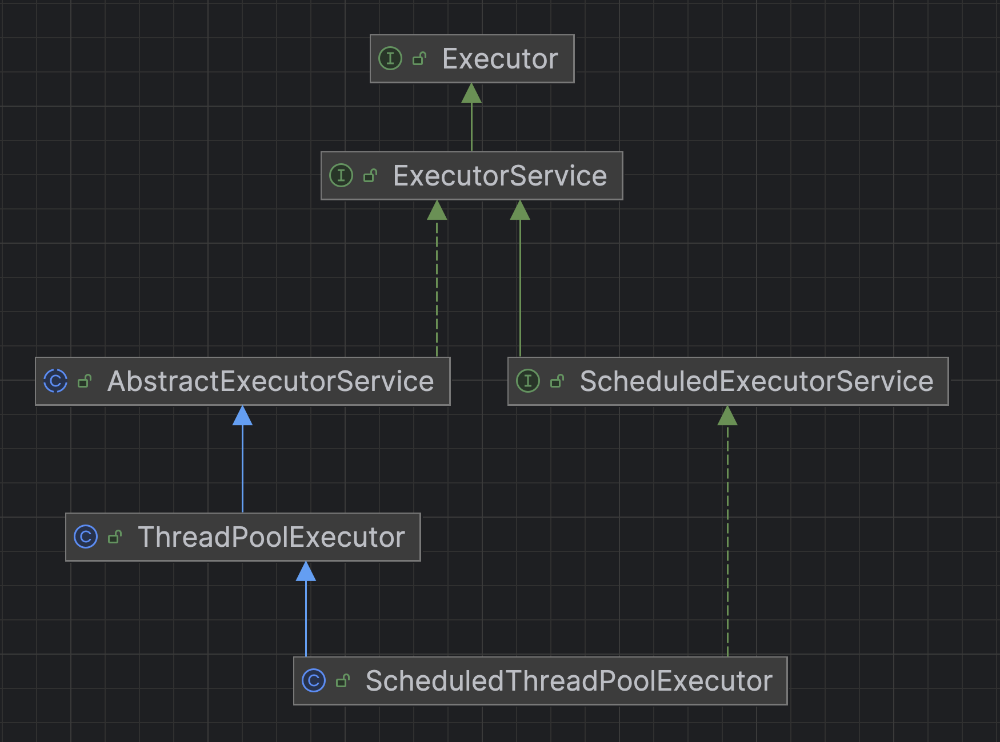
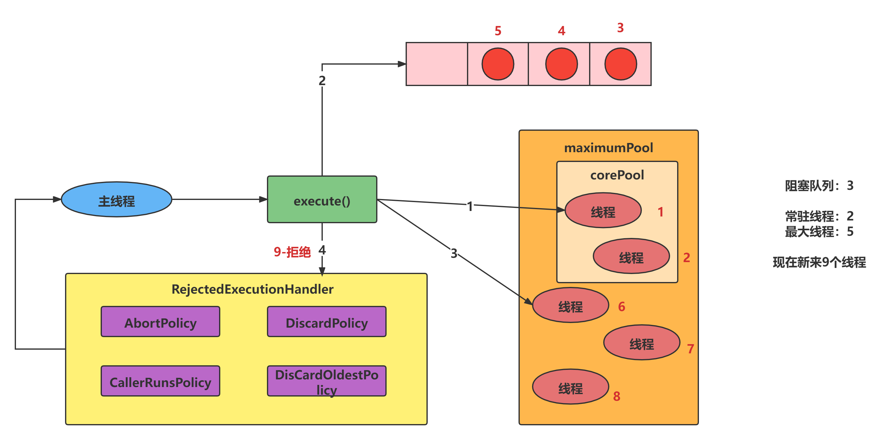

# Chap11. ThreadPool (线程池)

## 1. 概述
**链接池**是创建和管理连接的缓冲池的技术，这些连接准备好被任何需要它们的线程使用。

**线程池**维护着多个线程，等待监督管理者分配可并发执行的任务。

线程池的优势：

主要特点
1. 降低资源消耗
2. 提高响应速度
3. 提高线程的可管理性


## 2. 架构



## 3. 使用
1. 一池N线程：`Executors.newFixedThreadPool(int)`
2. 一池一线程：`Executors.newSingleThreadExecutor()`
3. 线程池根据需求创建线程，可扩容，遇强则强：`Executors.newCachedThreadPool()`

## 底层原理

## 七个参数
```java
public ThreadPoolExecutor(int corePoolSize,
                              int maximumPoolSize,
                              long keepAliveTime,
                              TimeUnit unit,
                              BlockingQueue<Runnable> workQueue,
                              ThreadFactory threadFactory,
                              RejectedExecutionHandler handler) {}
```
* `int corePoolSize`: 常驻线程数量(核心线程数量)
* `int maximumPoolSize`: 最大线程数量
* `long keepAliveTime`: 空闲线程存活时间
* `TimeUnit unit`
* `BlockingQueue<Runnable> workQueue`: 阻塞队列
* `ThreadFactory threadFactory`: 线程工厂，用于创建线程
* `RejectedExecutionHandler handler`: 拒绝策略


## 底层工作流程


拒绝策略
1. `AbortPolicy`(default): 直接抛出 `RejectedExecutionException`
2. `CallerRunsPolicy`: 
3. `DiscardOldestPolicy`: 
4. `DiscardPolicy`: 


## 自定义线程池
一般都用自定义线程池


## Reference
* [【JUC并发编程11】线程池](https://blog.csdn.net/xt199711/article/details/122806132?spm=1001.2014.3001.5501)