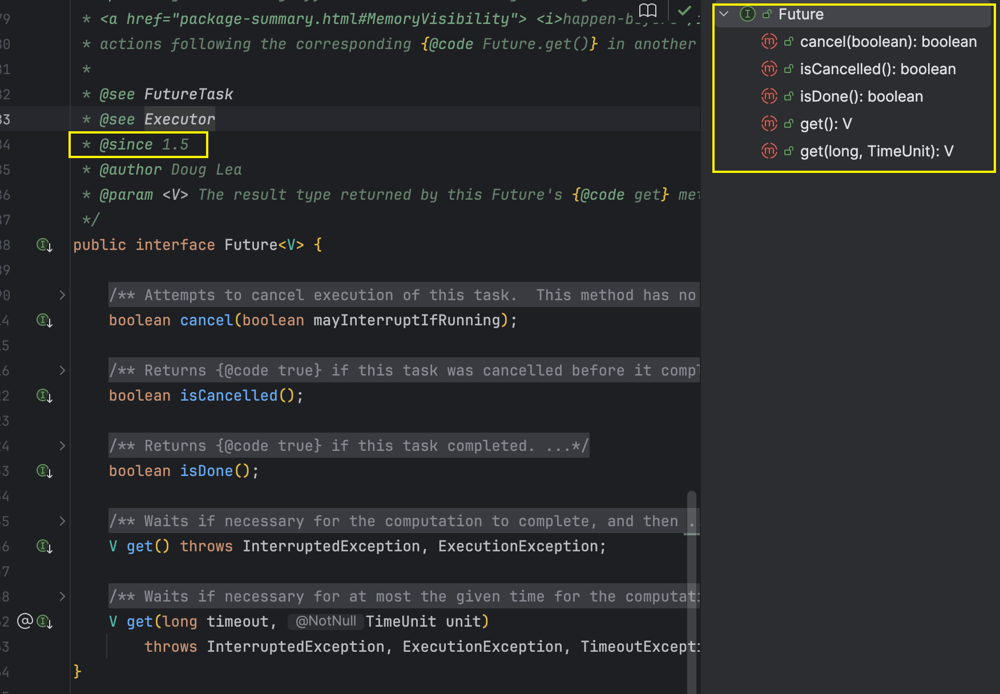
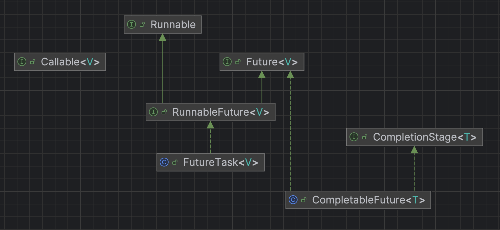
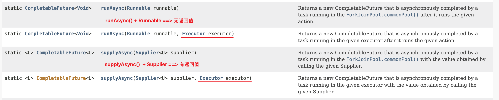

# Chap02. CompletableFuture

## 1. Future 接口理论知识复习
`Future`接口(`FutureTask`是其常用实现类)定义了操作异步任务执行一些方法，如获取异步任务的执行结果、取消异步任务的执行、判断任务是否被取消、判断任务执行是否完毕等。
```java
/**
 * @since 1.5
 * @author Doug Lea
 */
public interface Future<V> {

    /**
     * Attempts to cancel execution of this task. 
     */
    boolean cancel(boolean mayInterruptIfRunning);

    boolean isCancelled();

    boolean isDone();

    /**
     * Waits if necessary for the computation to complete, and then retrieves its result.
     */
    V get() throws InterruptedException, ExecutionException;

    /**
     * Waits if necessary for at most the given time for the computation to complete, and then retrieves its result, if available.
     */
    V get(long timeout, TimeUnit unit) throws InterruptedException, ExecutionException, TimeoutException;
}
```


举例：比如**主线程**让一个**子线程**去执行任务，子线程可能比较耗时，启动子线程开始执行任务后，主线程就去做其他事情了，忙完其他事情或者先执行完，过了一会再才去获取子任务的执行结果或变更的任务状态。


## 2. Future 接口常用使用类: FutureTask (异步任务)
### 2.1 Future 接口能干什么
`Future` 是 Java5 新添加的一个接口，它提供了一种**异步并行计算**的功能。
如果主线程需要执行一个很耗时的计算任务，我们就可以通过 `Future` 把这个任务放进异步线程中执行，主线程继续处理其他任务或者先行结束，再通过 `Future` 获取计算结果。

### 2.2 Future 接口相关构架
* **目的:** 异步多线程任务执行且返回有结果，三个特点：**多线程、有返回、异步任务**
* 代码实现: Runnable接口+Callable接口+Future接口 ==> FutureTask实现类。
  * `Runnable` and `Callable` 接口都可以用于创建线程：
    * `Thread(Runnable)`
    * `FutureTask(Callable) + Thread(FutureTask)`
  * `Callable` 可以返回结果
  * `Future` 可以用于实现异步



* Example: [FutureTaskDemo01.java](../AdvanceDemo01/src/main/java/com/ylqi007/chap02completablefuture/FutureTaskDemo01.java)
* Example: [RunnableCallableDemo01.java](../demo01/src/main/java/com/ylqi007/chap07callable/RunnableCallableDemo01.java)

### 2.3 Future 编码实战和优缺点分析
* 优点：`Future` + 线程池，实现**异步**、**多线程任务**配合，能显著提高程序的运行效率。
* 缺点：
  * `get()`阻塞：一旦调用`get()`方法求结果，一旦调用不见不散，非要等到结果才会离开，不管你是否计算完成，如果没有计算完成容易程序堵塞。
  * `isDone()`：轮询的方式会耗费无谓的CPU资源，而且也不见得能及时得到计算结果，如果想要异步获取结果，通常会以轮询的方式去获取结果，尽量不要阻塞。
  * Example: [FutureTaskDemo02.java](../AdvanceDemo01/src/main/java/com/ylqi007/chap02completablefuture/FutureTaskDemo02.java)
* 结论：Future对于结果的获取不是很友好，只能通过**阻塞或轮询**的方式得到任务的结果。

### 2.4 完成一些复杂的任务
对于简单的业务场景，使用 `FutureTask` 完全OK。

但是需要完成一些复杂任务的时候，我们可以从以下几个出发点思考
* 回调通知：
  * 应对 Future 的完成时间，完成之后可以告诉我，也就是所谓的**回调通知**
  * 通过轮询的方式去判断任务是否完成，这样非常占用 CPU 并且代码也不优雅。
* 创建异步任务的方式：
  * `FutureTask` + `Thread` ==> `FutureTask` + 线程池
* 多个任务前后依赖，可以通过组合处理(水煮鱼--->买鱼--->调料--->下锅):
  * 如果想将多个异步任务的结果组合起来，后一个异步任务的计算结果需要前一个异步任务的值。(A and B 串行)
  * 想将两个或多个异步计算合并成为一个异步计算，这几个异步计算相互独立，同时后面又依赖前一个处理结果。
* 对计算结果中，选择速度最快的：
  * 当`Future`集合中某个任务最快结束时，返回结果，返回第一名处理结果

* **结论:**
  * 使用`Future`提供的那点API应对以上的复杂情况就囊中羞涩，处理起来不够优雅，这时候还是让`CompletableFuture`以声明式的方式优雅的处理这些需求。从 i --> i++
  * `Future`能干的，`CompletableFuture`都能干


## 3. CompletableFuture 对 Future 的改进
### 3.1 CompletableFuture 为什么会出现
* `get()` 方法在 `Future` 计算完成之前会一直处在**阻塞**状态下，**阻塞的方式和异步编程的设计理念相违背**。
* `isDone()` 方法容易消耗CPU资源(CPU空转)。
* 对于真正的异步处理我们希望是可以通过**传入回调函数**，在 `Future` 结束时**自动调用该回调函数**，这样，我们就不用等待结果。

JDK8 设计出 `CompletableFuture`，`CompletableFuture` 提供了一种**观察者模式**类似的机制，可以让任务执行完成后通知监听的一方。

### 3.2 CompletableFuture 和 CompletionStage 介绍
架构说明


* **接口CompletionStage**
  * 代表异步计算过程中的某一个阶段，一个阶段完成以后可能会触发另外一个阶段。
  * 一个阶段的执行可能是被单个阶段的完成触发，也可能是由多个阶段一起触发。
* **CompletableFuture类**
  * 提供了非常强大的`Future`的扩展功能，可以帮助我们简化异步编程的复杂性，并且提供了函数式编程的能力，可以**通过回调的方式处理计算结果**，也提供了转换和组合CompletableFuture的方法。
  * 它可能代表一个明确完成的`Future`，也可能代表一个完成阶段(`CompletionStage`)，它支持在计算完成以后触发一些函数或执行某些动作。

### 3.3 核心的四个静态方法，来创建一个异步任务
四个静态构造方法

对于上述`Executor`参数说明：若没有指定，则使用默认的`ForkJoinPool.commonPool()`作为它的线程池执行异步代码，如果指定线程池，则使用我们自定义的或者特别指定的线程池执行异步代码。
* [CompletableFutureBuildTests.java](../AdvanceDemo01/src/main/java/com/ylqi007/chap02completablefuture/CompletableFutureBuildTests.java)
* `CompletableFuture` 减少阻塞和轮询，可以传入回调对象，当异步任务完成或者发生异常时，自动调用回调对象的回调方法。

#### 1. runAsync(Runnable)
#### 2. runAsync(Runnable, Executor)
#### 3. supplyAsync(Supplier)
#### 4. supplyAsync(Supplier, Executor)


## 4. 案例精讲 -- 电商网站的比价需求
### 4.1 Lambda表达式 + Stream流式调用 + Chain链式调用 + Java8函数式编程
#### 1. FunctionalInterface (函数式接口)
`@FunctionalInterface`(函数式接口)，以下是常见的四类 functional interface
* `Runnable`: `public abstract void run();` (`Runnable` 是 Java1.0 就存在的老接口，当时的 Java 代码风格是 显式写出所有修饰符，即使它是多余的。)
* `Consumer<T>`: `void accept(T t);`
  * `BiConsumer<T, U>`: `void accept(T t, U u);`
* `Supplier<T>`: `T get();`
  * `BiFunction<T, U, R>`: `R apply(T t, U u);`
* `Function<T, R>`: `R apply(T t);`

#### 2. Java链式调用 (Method chaining)
> Java 链式调用(Method Chaining)是一种编程风格，通过在一个对象的方法中返回该对象本身(`this`)或另一个对象，使得多个方法调用可以在一行连续书写，从而形成链状调用结构。

**1.简单例子:**
```java
String result = new StringBuilder()
        .append("Hello")
        .append(" ")
        .append("World")
        .toString();
```
这里的 `append()` 方法返回的是 当前 `StringBuilder` 对象本身，所以可以连续调用。

**2.核心原理:**
* 在方法内部，`return this;`
* 或者返回一个新的对象实例（可以是同类型，也可以是不同类型）
* 编译器会在每次调用时，将返回值继续作为下一个方法的调用者。

**3.常见用途:**
1. 构造器替代/Builder模式
2. 流式API：Java8 的 `Stream` API 就是典型的链式调用
3. JDBC/ORM 操作

案例代码: [ChainDemo.java](../AdvanceDemo01/src/main/java/com/ylqi007/chap02completablefuture/mall/ChainDemo.java)


### 4.2 大厂业务需求说明
✅**切记:** 功能--->性能（完成--->完美）

电商网站比价需求分析：
1. 需求说明： 
   1. 同一款产品，同时搜索出同款产品在各大电商平台的售价 
   2. 同一款产品，同时搜索出本产品在同一个电商平台下，各个入驻卖家售价是多少
2. 输出返回：
   1. 出来结果希望是同款产品的在不同地方的价格清单列表，返回一个`List<String>`
   2. 例如：《Mysql》 in jd price is 88.05  《Mysql》 in taobao price is 90.43
3. 解决方案，对比同一个产品在各个平台上的价格，要求获得一个清单列表
   1. step by step，按部就班，查完淘宝查京东，查完京东查天猫....
   2. all in，万箭齐发，一口气多线程异步任务同时查询


### 4.3 比价案例实战Case
* 测试代码: [CompletableFutureMallDemo.java](../AdvanceDemo01/src/main/java/com/ylqi007/chap02completablefuture/mall/CompletableFutureMallDemo.java)


## 5. CompletableFuture 常用方法
1. 获得计算结果和触发计算
2. 对计算结果进行处理
3. 对计算结果进行消费
4. 对计算速度进行选用
5. 对计算结果进行合并


### 5.1 获得计算结果和触发计算
#### 1. 获得计算结果
* `public T get()`  
* `public T get(long timeout, TimeUnit unit)`
* `public T join()`: 和get一样的作用，只是不需要抛出异常
* `public T getNow(T valueIfAbsent)`: 计算完成就返回正常值，否则返回备胎值（传入的参数），立即获取结果不阻塞

#### 2. 主动触发计算
* `public boolean complete(T value)`: 是否打断 `get()` 方法立即返回括号中的值

测试代码: [CompletableFutureAPI1GetJoinCompleteTest.java](../AdvanceDemo01/src/main/java/com/ylqi007/chap02completablefuture/CompletableFutureAPI1GetJoinCompleteTest.java)


### 5.2 对计算结果进行处理: `thenApply()`, `handle()`
1. `thenApply()`
   * 计算结果存在**依赖关系**，这两个线程**串行化**。
   * 由于存在依赖关系（当前步错，不会进入下一步），当前步骤有异常的话就叫停。
     * 出异常的步骤 --> `whenComplete()` --> `exceptionally()`
2. `handle()`
   * 计算结果存在**依赖关系**，这两个线程**串行化**。
   * 有异常也也以往下一步走，根据带的异常参数可以进入下一步处理。
3. 测试代码: [CompletableFutureAPI2ThenApplyHandleTest.java](../AdvanceDemo01/src/main/java/com/ylqi007/chap02completablefuture/CompletableFutureAPI2ThenApplyHandleTest.java)


### 5.3 对计算结果进行消费: `thenAccept(Consumer)`
接受任务的处理结果，并消费处理，无返回结果。
* `thenAccept(Consumer)`: 任务A执行完执行B，B需要A的结果，但是任务B没有返回值
* 对比补充
  * `thenRun(Runnable)`: 任务A执行完执行B，并且B不需要A的结果，相当于新起了线程任务
  * `thenApply(Function)` : 任务A执行完执行B，B需要A的结果，同时任务B有返回值
* 测试代码: [CompletableFutureAPI3AcceptRunApplyTest.java](../AdvanceDemo01/src/main/java/com/ylqi007/chap02completablefuture/CompletableFutureAPI3AcceptRunApplyTest.java)


### 5.4 对计算速度进行选用
* `applyToEither(CompletionStage, Function)`: 谁快就用谁
* 测试代码: [CompletableFutureAPI4ApplyToEitherTest.java](../AdvanceDemo01/src/main/java/com/ylqi007/chap02completablefuture/CompletableFutureAPI4ApplyToEitherTest.java)


### 5.5 对计算结果进行合并
两个 `CompletionStage` 任务都完成后，最终把两个任务的结果一起交给 `thenCombine()` 来处理。
先完成的先等着，等待其他分支任务。

* `thenCombine(CompletionStage, BiFunction)`
* 测试代码: [CompletableFutureAPI5ThenCombineTest.java](../AdvanceDemo01/src/main/java/com/ylqi007/chap02completablefuture/CompletableFutureAPI5ThenCombineTest.java)


### ✅ CompletableFuture和线程池结合使用说明
* `thenRunAsync(Runnable)`
* `thenAcceptAsync(Consumer)`
* `thenApplyAsync(Function)`
* 测试代码(只集中测试了`thenRunAsync()`): [CompletableFutureAPI3ThenRunAsyncWithThreadPoolTest.java](../AdvanceDemo01/src/main/java/com/ylqi007/chap02completablefuture/CompletableFutureAPI3ThenRunAsyncWithThreadPoolTest.java)

**总结说明:**
* 如果没有传入自定义线程池，都用默认线程池 `ForkJoinPool`
* 如果你执行第一个任务时，传入了一个自定义线程池
  * 调用 `thenRun()` 方法执行第二个任务时，则第二个任务和第一个任务时共用同一个线程池
  * 调用 `thenRunAsync()` 执行第二个任务时，则第一个任务使用的是你自定义的线程池，第二个任务使用的是 `ForkJoinPool` 线程池
* **备注**: 可能是线程处理太快，系统优化切换原则，直接使用`main`线程处理，`thenAccept()`和`thenAcceptAsync()`，`thenApply()`和`thenApplyAsync()`等，之间的区别同理。
  * 方法名后面有无`Async`的区别是，有`Async`的方法在底层会调用`uniRunStage(asyncPool,action);`方法，将线程池更改为`ForkJoinPool`而不是自定义线程池


# --- Split ---

多线程要满足的三个特点
1. 多线程
2. 有返回
3. 异步任务


```java
Thread(Runnable target, String name);
```
1. Runnable 接口可以满足多线程
2. 不满足有返回值
3. 不满足异步，被取消，被叫停等等

* Runnable + Future ==> RunnableFuture ==> FutureTask


### 3. Future 的优缺点分析
### get() 容易阻塞
### isDone() 轮询


### 4. 如何完成更复杂的任务？
### Future 异步优化思路
* 对简单任务，Future完全OK

1. 回调通知
2. 创建异步任务：Future + 线程池配合
3. 多个异步任务组合：水煮鱼
4. 对计算结果选择最快的

==> 从 Future ==> CompletableFuture


## 3. CompletableFuture 对 Future 的改进

runAsync()
supplyAsync()

### CompletableFuture 之通用异步编程


