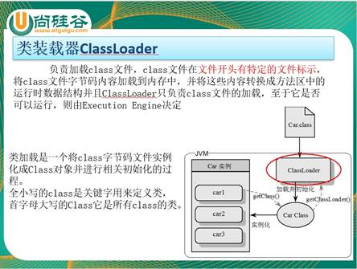
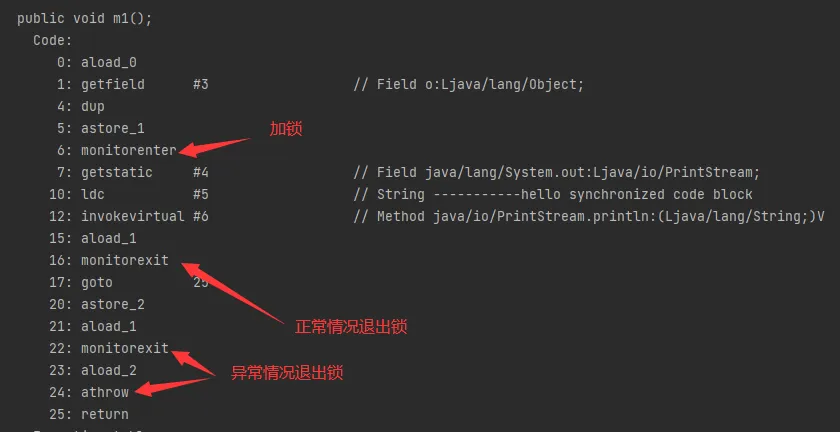
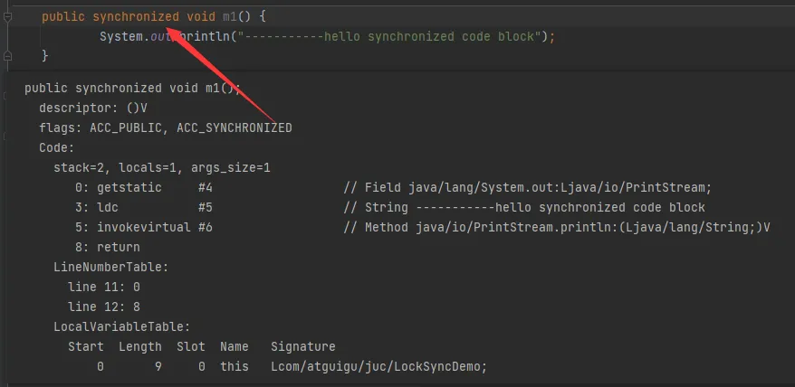
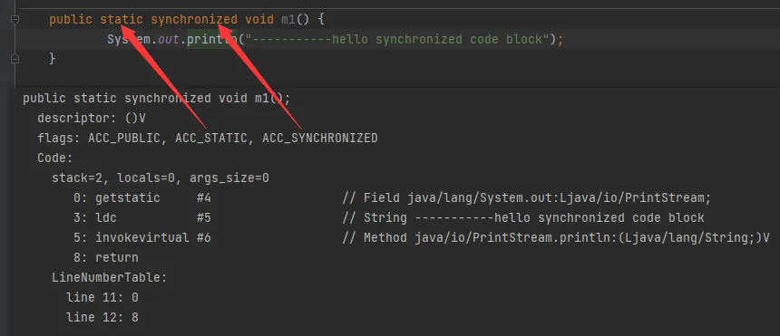
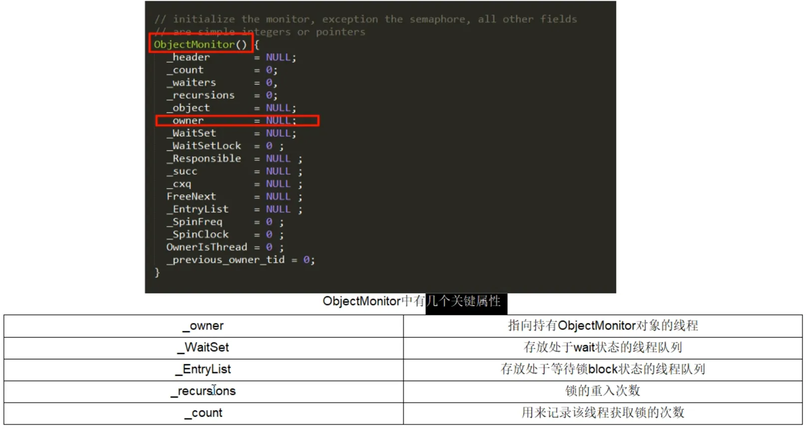
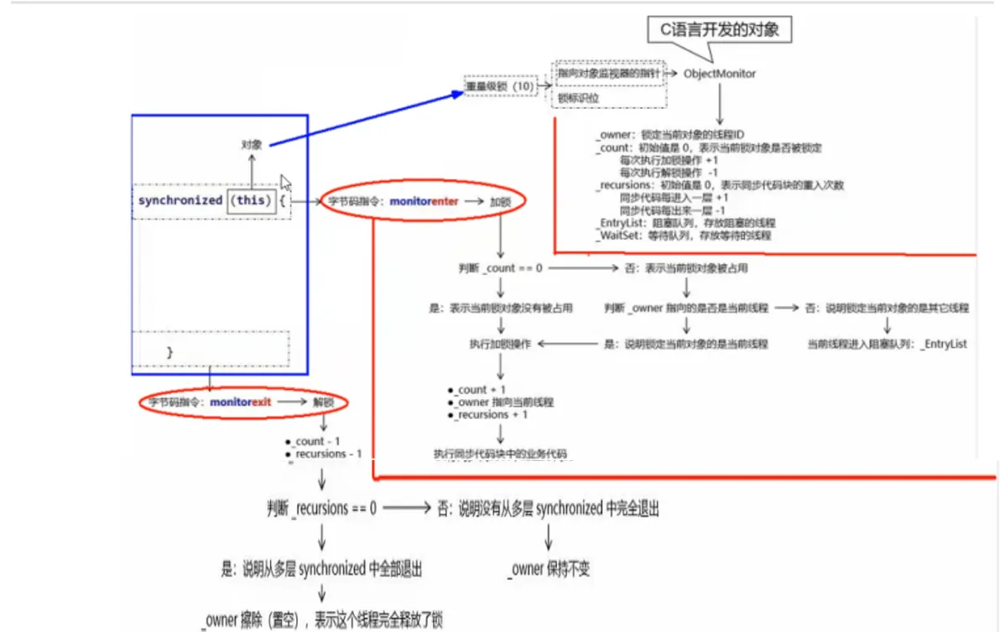
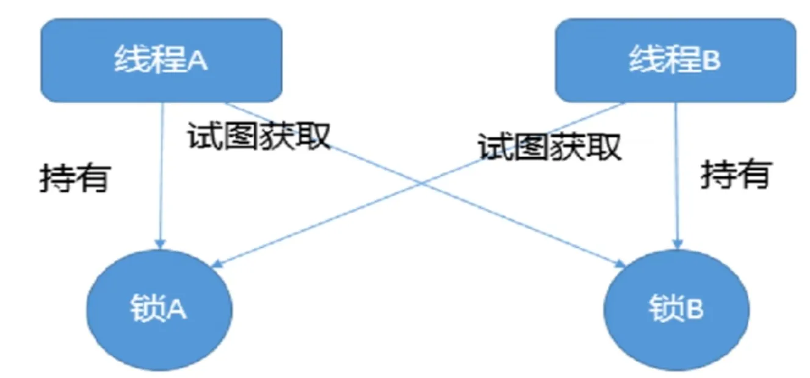

# Chap03. Java锁

## 1. 乐观锁和悲观锁
### 1.1 悲观锁
**悲观锁**，认为自己在使用数据的时候，**一定有别的线程来修改数据**，因此在获取数据的时候会先加锁，确保数据不会被别的线程修改。
* `synchronized`和`Lock`的实现类都是悲观锁，**适合写操作多的场景**。
* 先加锁可以保证写操作时数据正确，显式的锁定之后再操作同步资源--狼性锁。


### 1.2 乐观锁
乐观锁，认为自己在使用数据的时候，不会有别的线程修改数据或资源，不会添加锁。
* Java中使用无锁编程来实现，只是在更新的时候去判断，之前有没有别的线程更新了这个数据，如果这个数据没有被更新，当前线程将自己修改的数据成功写入，如果已经被其他线程更新，则根据不同的实现执行不同的操作，比如：放弃修改、重试抢锁等等。
  * 乐观锁一般有两种实现方式：
    * 版本号机制 Version，
    * 最常采用的是 CAS 算法，Java原子类中的递增操作就是通过 CAS 自旋实现的。
* 适合读操作多的场景。
* 不加锁的特性能够使其读操作的性能大幅提升，乐观锁则直接去操作同步资源，是一种无锁算法，得之我幸，失之我命--佛系锁。


### 1.3 伪代码案例
#### 悲观锁的调用方式1: synchronized
```java
// 悲观锁的调用方式
public synchronized void fun() {
    // 加锁后的业务逻辑
}
```

#### 悲观锁的调用方式1: Lock
```java
import java.util.concurrent.locks.ReentrantLock;
// 保证多个线程使用的是同一个 lock 对象的前提下
ReentrantLock lock = new ReentrantLock();
public void fund() {
    lock.lock();
    try {
        // 操作同步资源
    } finally {
        lock.unlock();
    }
}
```

#### 乐观锁的调用方式
```java
import java.util.concurrent.atomic.AtomicInteger;

// 保证多个线程使用的是同一个 AtomicInteger
private AtomicInteger atomicInteger = new AtomicInteger();
atomicInteger.incrementAndGet();
```


## 2. 通过8种情况演示锁运行案例，深入 synchronized
### 2.1 synchronized 锁的 8 种案例演示
以下是《阿里巴巴Java开发手册》中，关于并发的规定
> 【强制】高并发时，同步调用应该去考量锁的性能损耗。能用无锁数据结构，就不要用锁；能锁区块，就不要锁整个方法体；能用对象锁，就不要用类锁。
> 说明： 尽可能使加锁的代码块工作量尽可能的小，避免在锁代码块中调用 RPC 方法。

✅**代码演示:**
* [Synchronized8Demo.java](../AdvanceDemo01/src/main/java/com/ylqi007/chap03locks/sync/Synchronized8Demo.java)
* [Lock8Demo.java](../AdvanceDemo01/src/main/java/com/ylqi007/chap03locks/sync/Lock8Demo.java) [太乱，要删掉]

#### ✅ 结论
* 对于**普通同步方法**，锁的是当前实例对象，通常指`this`，**所有的普通同步方法**用的都是同一把锁--->实例对象本身
* 对于**静态同步方法**，锁的时当前类的`Class`对象
* 对于**同步方法块**，锁的时`synchronized`括号内的对象


### 2.2 synchronized 的三种应用方式
**JDK源码(`Object.notify()`)说明:
> `public final void notify()`
> This method should only be called by a thread that is the owner of this object's monitor. A thread becomes the owner of the object's monitor in one of three ways:
> * By executing a synchronized instance method of that object.
> * By executing the body of a synchronized statement that synchronizes on the object.
> * For objects of type Class, by executing a synchronized static method of that class.
> 
> Only one thread at a time can own an object's monitor.

* Java17 Doc: https://docs.oracle.com/en/java/javase/17/docs/api/java.base/java/lang/Object.html#notify()

#### ✅ 结论
1. 作用于**实例方法**，当前实例加锁，进入同步代码前要获得当前实例的锁；
2. 作用于**代码块**，对括号里配置的对象加锁；
3. 作用于**静态方法**，当前类加锁，进去同步代码前要获得当前类对象的锁；




### 2.3 从字节码角度分析`synchronized`实现
通过 `javap` 命令，反编译 `.class` 文件
```shell
javap -c xxx.class # 文件反编译
javap -v xxx.class # 包含更多信息的反编译
```
Example:
```shell
javap -c SynchronizedClassDemo

  public void method1();
    Code:
       0: aload_0
       1: getfield      #7                  // Field object:Ljava/lang/Object;
       4: dup
       5: astore_1
       6: monitorenter
       7: getstatic     #13                 // Field java/lang/System.out:Ljava/io/PrintStream;
      10: invokestatic  #19                 // Method java/lang/Thread.currentThread:()Ljava/lang/Thread;
      13: invokevirtual #25                 // Method java/lang/Thread.getName:()Ljava/lang/String;
      16: invokedynamic #29,  0             // InvokeDynamic #0:makeConcatWithConstants:(Ljava/lang/String;)Ljava/lang/String;
      21: invokevirtual #33                 // Method java/io/PrintStream.println:(Ljava/lang/String;)V
      24: aload_1
      25: monitorexit
      26: goto          34
      29: astore_2
      30: aload_1
      31: monitorexit
      32: aload_2
      33: athrow
      34: return
    Exception table:
       from    to  target type
           7    26    29   any
          29    32    29   any
```

1. `synchronized(obj)` 用于代码块
   * 
2. `synchronized`, 即普通同步方法
   * 
3. `static synchronized`, 即静态同步方法
   * 


### 2.4 反编译后，synchronized 锁的是什么？(还需要深入)
**面试题：为什么任何一个对象都可以成为一个锁？**
* C++源码：`ObjectMonitor.java`--->`ObjectMonitor.cpp`--->`ObjectMonitor.hpp`
* 每个对象天生都带着一个对象监视器，每一个被锁住的对象都会和Monitor关联起来
* 总结: 指针指向Monitor对象（也称为管程或监视器）的真实地址。每个对象都存在着一个monitor与之关联，当一个monitor被某个线程持有后，它便处于锁定状态。在Java虚拟机（HotSpot）中，monitor是由`ObjectMonitor`实现的，其主要的数据结构如下（位于HotSpot虚拟机源码ObjectMonitor.hpp文件，C++实现）：
  * 
* 来自评论: 在Java中，确实每个对象都可以成为锁，这是因为Java对象头中包含了锁相关的信息。具体来说，在HotSpot JVM 的实现中，对象头包含了一个标记字(Mark Word)，用于存储对象的哈希码、分代年龄和锁状态标志等信息。
  当对象被作为锁使用时：
  1. 在轻量级锁或偏向锁状态下，锁信息直接存储在对象头的Mark Word中。
  2. 当锁升级为重量级锁时，JVM会创建一个与此对象关联的ObjectMonitor实例，并将对象头中的Mark Word指向这个monitor。 
  3. 关于ObjectMonitor实现的说法是正确的。在HotSpot JVM中，重量级锁确实是通过C++实现的ObjectMonitor类来管理的。这个类定义在ObjectMonitor.hpp文件中，实现在ObjectMonitor.cpp中。 
  4. 不过有一点需要澄清：并不是每个对象一开始就关联着一个ObjectMonitor实例，这样会非常浪费内存。只有当对象的锁被升级为重量级锁时，JVM才会创建ObjectMonitor实例并与对象关联。这种按需创建的策略是HotSpot JVM锁优化(如轻量级锁、偏向锁)的一部分。





### 2.5 对于 synchronized 关键字，深入
后续章节详述


## 3. 公平锁和非公平锁
### 3.1 何为公平锁和非公平锁
* **公平锁**：是指多个线程按照申请锁的顺序来获取锁，这里类似于排队买票，先来的人先买，后来的人再队尾排着，这是公平的。
  * `Lock lock = new ReentrantLock(true)`---表示公平锁，先来先得。
* **非公平锁**：是指多个线程获取锁的顺序并不是按照申请的顺序，有可能后申请的线程比先申请的线程优先获取锁，在高并发环境下，有可能造成优先级反转或者饥饿的状态（某个线程一直得不到锁）
  * `Lock lock = new ReentrantLock(false)`---表示非公平锁，后来的也可能先获得锁，默认为非公平锁。
* 示例代码: [SellTicketDemo.java](../AdvanceDemo01/src/main/java/com/ylqi007/chap03locks/SellTicketDemo.java)


#### 面试题
* 为什么会有公平锁/非公平锁的设计？为什么默认非公平？ 
  * 恢复挂起的线程到真正锁的获取还是有时间差的，从开发人员来看这个时间微乎其微，但是从CPU的角度来看，这个时间差存在的还是很明显的。**所以非公平锁能更充分地利用CPU的时间片，尽量减少CPU空间状态时间。** 
  * 使用多线程很重要的考量点是线程**切换的开销**，当采用非公平锁时，**当一个线程请求锁获取同步状态，然后释放同步状态，所以刚释放锁的线程在此刻再次获取同步状态的概率就变得很大，所以就减少了线程的开销。**
* 什么时候用公平？什么时候用非公平？
  * 如果为了**更高的吞吐量**，很显然非公平锁是比较合适的，因为节省了很多线程切换的时间，吞吐量自然就上去了；否则就用公平锁，大家公平使用。


### 3.2 预埋伏 AQS


## 4. 可重入锁(递归锁)
### 4.1 概念说明
是指在**同一线程**在外层方法获取到锁的时侯，在进入该线程的内层方法会自动获取锁（前提，锁对象的是同一个对象），不会因为之前已经获取过还没释放而阻塞---------优点之一就是可一定程度避免死锁。


### 4.2 可重入锁种类
* **隐式锁**(即`synchronized`关键字使用的锁)，默认是可重入锁 
  * 在一个`synchronized`修饰的方法或者代码块的内部调用本类的其他`synchronized`修饰的方法或者代码块时，是永远可以得到锁。
* **显式锁**(即Lock)也有 `ReentrantLock` 这样的可重入锁
* 实例代码: [ReEntryLockDemo.java](../AdvanceDemo01/src/main/java/com/ylqi007/chap03locks/ReEntryLockDemo.java)


## 5. 死锁及排查
### 5.1 概念
死锁是指两个或两个以上的线程在执行过程中，因抢夺资源而造成的一种**互相等待**的现象，若无外力干涉，则它们无法再继续推进下去。

产生原因:
* 系统资源不足
* 进程运行推进顺序不合适
* 系统资源分配不当




### 5.2 写一个死锁代码case
* [DeadLockDemo.java](../AdvanceDemo01/src/main/java/com/ylqi007/chap03locks/DeadLockDemo.java)


### 5.3 如何排查死锁
1. 纯命令 `jps + jstack`
   1. `jps -l` 查看进程编号(`pid`)
   2. `jstack <pid>`
2. 图形化
   1. `jconsole`


## 6. 写锁(独占锁)/读锁(共享锁)

## 7. 自旋锁spinLock

## 8. 无锁 -> 独占锁 -> 读写锁 -> 邮戳锁

## 9. 无锁 -> 偏向锁 -> 轻量锁 -> 重量锁


## Reference
* [3. 说说Java"锁"事](https://www.yuque.com/gongxi-wssld/csm31d/ggu5fkrl3grpwwb4#Td0Wb)