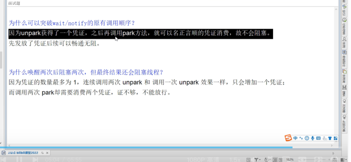

# Chap04. LockSupport 与线程中断

## 1. 线程中断机制
### 1.1 蚂蚁金服面试题

* 如何**中断**一个运行中的线程？ 
* 如何**停止**一个运行中的线程？

### 1.2 什么是中断机制
1. 首先，一个线程不应该由其他线程来强制中断或停止，而是应该**由线程自己自行停止**，自己来决定自己的命运，所以，`Thread.stop()`, `Thread.suspend()`, `Thread.resume()`都已经被废弃了。
2. 其次，在Java中没有办法立即停止一条线程，然而停止线程却显得尤为重要，如取消一个耗时操作。因此，Java提供了一种用于停止线程的协商机制--**中断**，也即**中断标识协商机制**
   * **中断只是一种协作协商机制，Java没有给中断增加任何语法，中断的过程完全需要程序员自行实现**。若要中断一个线程，你需要手动调用该线程`interrupt()`方法，该方法也仅仅是将该线程对象的**中断标识**设置为`true`，接着你需要自己写代码不断检测当前线程的标识位，如果为`true`，表示别的线程请求这条线程中断，此时究竟应该做什么需要你自己写代码实现。
   * 每个线程对象都有一个**中断标识位**，用于表示线程是否被中断；该标识位为true表示中断，为false表示未中断；通过调用线程对象的`interrupt()`方法将该线程的标识位设置为true；可以在别的线程中调用，也可以在自己的线程中调用。

### 1.3 中断的相关API的三大方法
* `public void interrupt()`
  * 实例方法 Just to set the interrupt flag
  * 实例方法仅仅是设置**该线程**的中断状态为true，发起一个协商而不会立刻停止线程
* `public static boolean interrupted()`
  * 静态方法`Thread.interrupted()`
  * **判断线程是否被中断**并**清除当前中断状态**（做了两件事情）
    1. 返回当前线程的中断状态，测试当前线程是否已被中断
    2. 将当前线程的中断状态清零并重新设置为false，清除线程的中断状态
  * 这个方法有点不好理解在于如果连续两次调用此方法，则第二次返回false，因为连续调用两次的结果可能不一样
* `public boolean isInterrupted()`
  * 实例方法
  * 判断当前线程是否被中断（通过检查中断标志位）

### 1.4 大厂面试题中断机制考点
#### 1. 如何停止中断运行中的线程？
1. 通过一个 `volatile` 变量实现
2. 通过 `AtomicBoolean`
3. 通过 `Thread` 类自带的中断API实例方法实现----在需要中断的线程中**不断监听中断状态**，一旦发生中断，就执行相应的中断处理业务逻辑stop线程。
* 示例代码: [InterruptDemo1.java](../AdvanceDemo01/src/main/java/com/ylqi007/chap04interrupt/InterruptDemo1.java)

#### 2. 当前线程的中断标识为true，是不是线程就立刻停止？
答案是不立刻停止

具体来说，当对一个线程，调用 `interrupt()` 时：
1. 如果线程处于正常活动状态，那么会将该线程的中断标志设置为`true`，**仅此而已，被设置中断标志的线程将继续正常运行，不受影响**，所以 `interrupt()` 并不能真正的中断线程，需要被调用的线程自己进行配合才行，对于不活动的线程没有任何影响。 
2. 如果线程处于阻塞状态（例如`sleep,wait,join`状态等），在别的线程中调用当前线程对象的 `interrupt()` 方法，那么线程将立即退出被阻塞状态（interrupt状态也将被清除），并抛出一个`InterruptedException` 异常。
   * 源码分析如下
   * 
     * `t.inerrupted = true` 时，清除interrupt状体，即将 `t.interrupt` 重置为 `false`，然后返回 `true`。
     * `t.interrupted = false` 时，已经处于 `t.interrupt = false` 状态，直接返回 `false`。
   * 总之，需要记住的是，**中断**只是一种协商机制，修改中断标识位仅此而已，不是立即stop中断。

实例代码: [InterruptDemo3.java](../AdvanceDemo01/src/main/java/com/ylqi007/chap04interrupt/InterruptDemo3.java)

#### 3. 对于静态方法Thread.interrupted()和实例方法isInterrupted()区别在于：
* 静态方法`Thread.interrupted()`，谈谈你的理解？
  * 
* 示例代码：[InterruptDemo4.java](../AdvanceDemo01/src/main/java/com/ylqi007/chap04interrupt/InterruptDemo4.java)

对于**静态方法**`Thread.interrupted()`和**实例方法**`isInterrupted()`区别在于：
* 静态方法`Thread.interrupted()`将会清除中断状态（传入的参数ClearInterrupted为`true`）
* 实例方法`isInterrupted()`则不会（传入的参数ClearInterrupted为`false`）
* 

### 1.5 总结
1. `public void interrupt()` 是一个**实例方法**，它通知目标线程中断，也仅仅是设置目标线程的中断标志位为**true**
2. `public boolean isInterrupted()` 是一个**实例方法**，它判断当前线程是否被中断（通过检查中断标志位）并获取中断标志
3. `public static boolean interrupted()` 是一个**静态方法**，返回当前线程的中断真实状态（boolean类型）后会将当前线程的中断状态设为`false`，此方法调用之后会清楚当前线程的中断标志位的状态（将中断标志置为false了），返回当前值并清零置为false。

## 2. LockSupport是什么
LockSupport是用来创建锁和其他同步类的基本线程阻塞原语，其中park()和unpack()而作用分别是阻塞线程和解除阻塞线程.

## 3. 线程等待唤醒机制
### 3.1 三种让线程等待和唤醒的方法
* Method 1: 使用`Object`中的`wait()`方法让线程等待，使用`Object`中的`notify()`方法唤醒线程。
* Method 2: 使用JUC包中的`Condition`的`await()`方法让线程等待，使用`signal()`方法唤醒线程。
* Method 3: LockSupport类可以阻塞当前线程以及唤醒指定被阻塞的线程

### 3.2 `Object.wait()` and `Object.notify()` 实现线程等待和唤醒
⚠️注意：
* `wait()`和`notify()`方法必须要在同步代码块或方法里面，且成对出现使用。
* 必须先`wait()`，再`notify()`，才能正常工作，否则会造成线程阻塞。

示例代码: [Demo01SynchronizedWaitNotify.java](../AdvanceDemo01/src/main/java/com/ylqi007/chap04locksupport/Demo01SynchronizedWaitNotify.java)

### 3.3 `Condition`接口中的`await()` and `signal()` 实现线程等待和唤醒
⚠️注意：
* `Condition`中的线程等待和唤醒方法，需要先获取锁
* 一定要先`await()`后`signal()`，不要反了

示例代码: [Demo02LockConditionAwaitSignal.java](../AdvanceDemo01/src/main/java/com/ylqi007/chap04locksupport/Demo02LockConditionAwaitSignal.java)

### 3.4 上述两个对象Object和Condition使用的限制条件
1. 线程需要先获得并持有锁，必须在锁块（synchronized或lock）中
2. 必须要先等待后唤醒，线程才能够被唤醒

### 3.5 LockSupport类中的`park()`等待和`unpark()`唤醒
* 是什么 
  * `LockSupport` 是用于创建锁和其他同步类的基本线程阻塞原语 
  * `LockSupport`类使用了一种名为Permit（许可）的概念来做到阻塞和唤醒线程的功能，每个线程都有一个许可（Permit），许可证只能有一个，**累加上限是1**。
* 主要方法 
  * 阻塞: Peimit许可证默认没有不能放行，所以一开始调用`park()`方法当前线程会阻塞，直到别的线程给当前线程发放peimit，park方法才会被唤醒。 
    * `park/park(Object blocker)`-------阻塞当前线程/阻塞传入的具体线程 
  * 唤醒: 调用`unpack(thread)`方法后 就会将thread线程的许可证peimit发放，会自动唤醒park线程，即之前阻塞中的`LockSupport.park()`方法会立即返回。 
    * `unpark(Thread thread)`------唤醒处于阻塞状态的指定线程

实例代码: [Demo03LockSupport.java](../AdvanceDemo01/src/main/java/com/ylqi007/chap04locksupport/Demo03LockSupport.java)

#### ⚠️重点说明(重要)
* `LockSupport`是用来创建锁和其他同步类的基本线程阻塞原语，所有的方法都是静态方法，可以让线程再任意位置阻塞，阻塞后也有对应的唤醒方法。归根结底，`LockSupport`时调用`Unsafe`中的native代码
* `LockSupport`提供`park()`和`unpark()`方法实现阻塞线程和解除线程阻塞的过程，LockSupport和每个使用它的线程都有一个许可（Peimit）关联，每个线程都有一个相关的permit，peimit最多只有一个，重复调用unpark也不会积累凭证。
* 形象理解：线程阻塞需要消耗凭证（Permit），这个凭证最多只有一个
  * 当调用park时，如果有凭证，则会直接消耗掉这个凭证然后正常退出。如果没有凭证，则必须阻塞等待凭证可用；
  * 当调用unpark时，它会增加一个凭证，但凭证最多只能有1各，累加无效。

#### 面试题
* 为什么LockSupport可以突破wait/notify的原有调用顺序？
  * 因为`unpark()`获得了一个凭证，之后再调用`park()`方法，就可以名正言顺的凭证消费，故不会阻塞，先发放了凭证后续可以畅通无阻。
* 为什么唤醒两次后阻塞两次，但最终结果还会阻塞线程？
  * 因为凭证的数量最多为1，连续调用两次`unpark()`和调用一次`unpark()`效果一样，只会增加一个凭证，而调用两次`park()`却需要消费两个凭证，证不够，不能放行。
* 

## Reference
* 语雀: [4. LockSupport与线程中断](https://www.yuque.com/gongxi-wssld/csm31d/zvimvldac4smghrt#nfMZk)