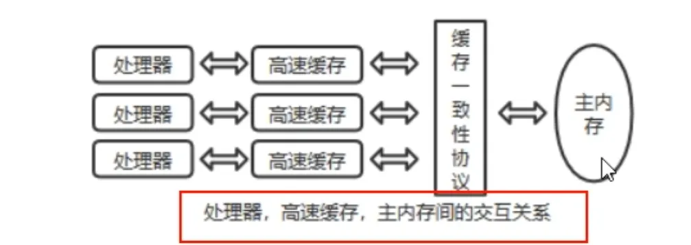
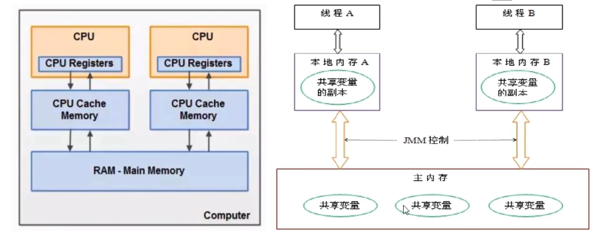
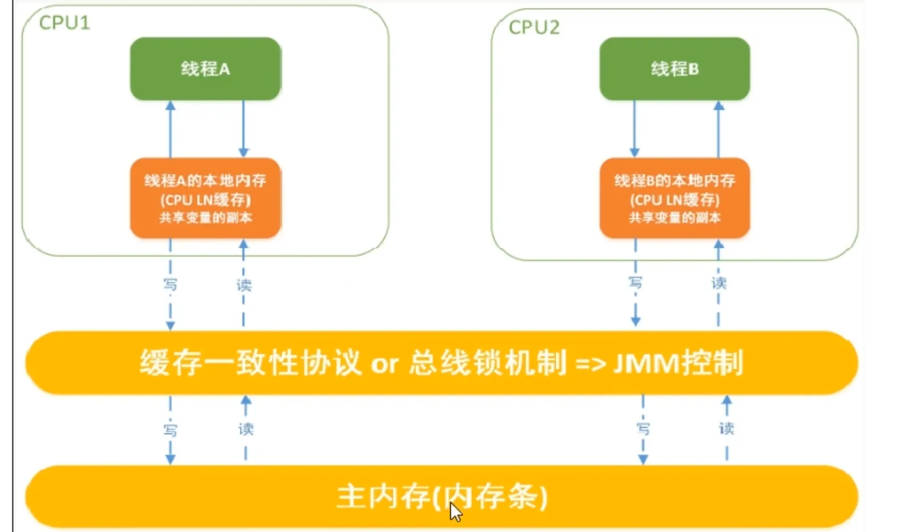

# Chap05. Java内存模型之JMM

## 1. 大厂面试题
* 你知道什么是Java内存模型(Java Memory Model, JMM)吗？
* JMM 和 `volatile` 他们两个之间的关系？
* JMM 有那些特征或者它的三大特征是什么？
* 为什么要有 JMM，它为什么出现？作用和功能是什么？
* happens-before 先行并发原则你有了解过吗？

## 2. 计算机硬件存储体系

* **CPU的运行并不是直接操作内存而是先把内存里面的数据读到缓存**，而内存的读和写操作的时候会造成不一致的问题。
* **JVM规范**中试图定义一种**Java内存模型**来**屏蔽掉各种硬件和操作系统的内存访问差异**，以实现让Java程序再各种平台下都能**达到一致性的内存访问效果**。

## 3. Java Memory Model (Java 内存模型)

JMM(Java Memory Model, Java内存模型)本身是一种**抽象的概念并不真实存在**，**它仅仅描述的是一组约定或规范**，通过这组规范定义了程序中(尤其是多线程)各个变量的读写访问方式并决定一个线程对共享变量的写入以及如何变成对另一个线程可见，关键技术点都是围绕多线程的**原子性、可见性和有序性**展开的。

## 4. JMM 规范下的三大特性
1. 可见性
2. 原子性
3. 有序性

### 4.1 可见性
**可见性**是指当一个线程修改了某一个共享变量的值，其他线程是否能够立即知道该变更。

JMM 规定了所有的变量都存在主内存中。

* 系统中主内存的**共享变量**修改写入的时机是不确定的，**多线程并发**下很可能出现“脏读”，所以每个线程都有自己的**工作内存**，线程自己的工作内存中保存了该线程使用到的变量的**主内存副本拷贝**。
* 线程对变量的所有操作（读取、赋值等）都必须在线程自己的工作内存中进行，而不能直接写入主内存中的变量，不同线程之间也无法直接访问对方工作内存中的变量，线程之间的变量值传递均需要通过主内存来完成。

#### 线程脏读案例
1. 主内存中有变量X，初始值为0
2. 线程A要将X加1，先将X=0拷贝到自己的私有内存中，然后更新X的值
3. 线程A将更新后的X值回刷到主内存的时间是不固定的
4. 刚好在线程A没有回刷x到主内存时，线程B同样从主内存中读取X，此时为0，和线程A一样的操作，最后期盼的X=2就会变成X=1

### 4.2 原子性
指一个操作是不可能被打断的，即多线程环境下，操作不能被其他线程干扰。

### 4.3 有序性
对于一个线程的执行代码而言，我们总是习惯性地认为代码的执行总是从上到下，有序执行。但为了提升性能，**编译器和处理器通常会对指令序列进行重新排序**。Java规范规定JVM线程内部维持顺序化语义，即只要程序的最终结果与它顺序话执行的结果相等，那么指令的执行顺序可以与代码顺序不一致，此过程叫**指令的重排序**。

**优缺点:**
* JVM能根据处理器特性（CPU多级缓存系统、多核处理器等）适当的对机器指令进行重排序，使机器指令更符合CPU的执行特性，最大限度的发挥机器性能。
* 但是指令重排可以保证串行语义一致，**但没有义务保证多线程的语义也一致（即可能产生“脏读”）**，简单而言就是两行以上不相干的代码在执行的时候有可能先执行的不是第一条，不见得是从上到下顺序执行，执行顺序会被优化。

#### 从源码到最终执行示例图

* **单线程环境**里确实能够保证程序最终执行结果和代码顺序执行的结果一致。
* **多线程环境**中线程交替执行，由于编译器优化重排的存在，可能出现乱序现象，两个线程使用的变量能否保证一致性是无法确定的，结果无法预测。

## 5. JMM规范下多线程对变量的读写过程
由于JVM运行程序的实体是线程，而每个线程创建时JVM都会为其创建一个工作内存（有的地方成为栈空间），工作内存是每个线程的私有数据区域，而Java内存模型中规定所有变量都存储在主内存，**主内存是共享内存区域，所有线程都可以访问，但线程对变量的操作（读写赋值等）必须在工作内存中进行，首先要将变量从主内存拷贝到线程自己的工作内存空间，然后对变量进行操作，操作完成后再将变量写回主内存**，不能直接操作主内存中的变量，各个线程中的工作内存存储着主内存中的变量副本拷贝，因此不同的线程无法访问对方的工作内存，线程间的通信（传值）必须通过主内存来完成，其简要访问过程如下图：

JMM定义了线程和主内存之间的抽象关系：
1. 线程之间的共享变量存储在主内存中（从硬件角度讲就是内存条）
2. 每个线程都有一个自己的本地工作内存，本地工作内存中存储了该线程用来读写共享变量的副本（从硬件角度来说就是CPU的缓存）

### 小总结
* 我们定义的所有共享变量都储存在物理主内存中
* 每个线程都有自己**独立的工作内存**，里面保证该线程使用到的**共享变量的副本**（主内存中该变量的一份拷贝）
* 线程对共享变量所有的操作都必须先在线程自己的工作内存中进行后写回主内存，不能直接从主内存在读写（不能越级）
* 不同线程之间也无法直接访问其他线程的工作内存中的变量，线程间变量值的传递需要通过主内存来进行（同级不能互相访问）。

## 6. JMM 规范下多线程现行发生原则之 happens-before
在JVM中，如果一个操作**执行的结果**需要对另一个操作可见或者代码重排序，那么这两个操作之间必须存在happens-before（先行发生）原则，逻辑上的先后关系。

### 6.1 x,y 案例说明

### 6.2 先行并发原则说明
如果Java内存模型中所有的有序性都仅靠 `volatile` 和 `synchronized` 来完成，那么有很多操作都将变得非常罗嗦，但是我们在编写Java并发代码的时候并没有察觉到这一点。

我们没有**时时、处处、次次**，添加volatile和synchronized来完成程序，这是因为Java语言中JMM原则下，有一个“先行发生”（happens-before）的原则限制和规矩，给你理好了规矩！

**这个原则非常重要**：它是判断数据是否存在竞争，线程是否安全的非常有用的手段。依赖这个原则，我们可以通过几条简单规则一揽子解决并发环境下两个操作之间是否可能存在冲突的所有问题，而不需要陷入Java内存模型晦涩难懂的底层编译原理之中。

### 6.3 happens-before 总原则
* 如果一个操作happens-before另一个操作，那么第一个操作的执行结果将对第二个操作可见，而且第一个操作的执行顺序排在第二个操作之前。
* 如果两个操作之间存在happens-before关系，并不意味着一定要按照happens-before原则制定的顺序来执行。如果重排之后的执行结果与按照happens-before关系来执行的结果一致，那么这种重排序并不非法。

### 6.4 happens-before 之8条
从JDK 5开始，Java使用新的JSR-133内存模型，提供了 happens-before 原则来辅助保证程序执行的原子性、可见性以及有序性的问题，它是判断数据是否存在竞争、线程是否安全的依据，happens-before 原则内容如下：
1. 次序规则：一个线程内，按照代码的顺序，写在前面的操作先行发生于写在后面的操作，也就是说前一个操作的结果可以被后续的操作获取（保证语义串行性，按照代码顺序执行）。比如前一个操作把变量x赋值为1，那后面一个操作肯定能知道x已经变成了1
2. 锁定规则：一个unLock操作先行发生于后面对同一个锁的lock操作（后面指时间上的先后）。
3. `volatile`变量规则：对一个`volatile`变量的**写操作**先行发生于后面对这个变量的**读操作**，前面的写对后面的读是可见的，这里的后面同样指时间上的先后
4. 传递规则：如果操作A先行发生于操作B，而操作B又先行发生于操作C，则可以得出操作A先行发生于操作C。
5. 线程启动规则（Thread start Rule）：Thread对象的`start()`方法先行发生于此线程的每一个动作
6. 线程中断规则（Thread Interruption Rule）：
   1. 对线程`interrupt()`方法的调用先行发生于被中断线程的代码检测到中断事件的发生 
   2. 可以通过`Thread.interrupted()`检测到是否发生中断 
   3. 也就是说你要先调用interrupt()方法设置过中断标志位，我才能检测到中断发生
7. 线程终止规则（Thread Termination Rule）：线程中的所有操作都优先发生于对此线程的终止检测，我们可以通过isAlive()等手段检测线程是否已经终止执行。
8. 对象终结规则（Finalizer Rule）：一个对象的初始化完成（构造函数执行结束）先行发生于它的finalize(）方法的开始------->对象没有完成初始化之前，是不能调用finalized()方法的

### 6.5 happens-before 小总结
* 在Java语言里面，Happens-before的语义本质上是一种可见性
* A happens-before B ,意味着A发生过的事情对B而言是可见的，无论A事件和B事件是否发生在同一线程里
* JVM的设计分为两部分： 
  * 一部分是面向我们程序员提供的，也就是happens-before规则，它通俗易懂的向我们程序员阐述了一个强内存模型，我们只要理解happens-before规则，就可以编写并发安全的程序了 
  * 另一部分是针对JVM实现的，为了尽可能少的对编译器和处理器做约束从而提升性能，JMM在不影响程序执行结果的前提下对其不做要求，即允许优化重排序，我们只要关注前者就好了，也就是理解happens-before规则即可，其他繁杂的内容由JMM规范结合操作系统给我们搞定，我们只写好代码即可。

### 6.6 案例说明
* [VolatileTest.java](../AdvanceDemo01/src/main/java/com/ylqi007/chap05jmm/VolatileTest.java)
