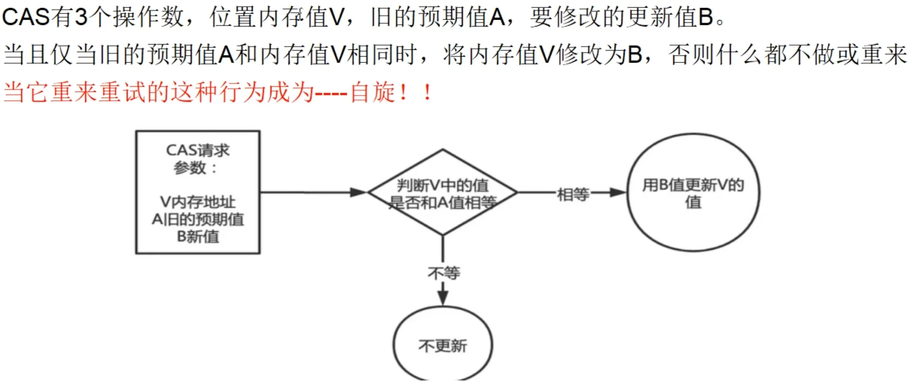
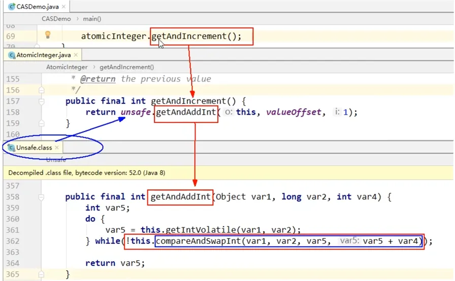
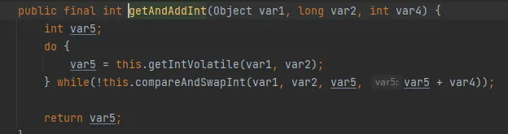

# Chap07. CAS (Compare-And-Swap)
Compare And Swap

## 1. 原子类
> A small toolkit of classes that support lock-free thread-safe programming on single variables. Instances of Atomic classes maintain values that are accessed and updated using methods otherwise available for fields using associated atomic VarHandle operations.
* [Package java.util.concurrent.atomic](https://docs.oracle.com/en/java/javase/17/docs/api/java.base/java/util/concurrent/atomic/package-summary.html)

## 2. 没有 CAS 之前
**多线程环境中**不使用原子类保证线程安全i++（基本数据类型）

代码示例：[Demo01Synchronized.java](../AdvancedJUC/src/main/java/com/ylqi007/chap07cas/Demo01Synchronized.java)

## 3. 使用 CAS 之后
**多线程环境中**使用原子类保证线程安全i++（基本数据类型）---------->类似于乐观锁

示例代码：[Demo02AtomicInteger.java](../AdvancedJUC/src/main/java/com/ylqi007/chap07cas/Demo02AtomicInteger.java)

## 4. 是什么?
CAS (Compare-And-Swap)，中文翻译为**比较并交换**，实现并发算法时常用到的一种技术，用于保证共享变量的**原子性操作**，它包含三个操作数：**内存位置**、**预期原值**与**跟新值**。

执行 CAS 操作的时候，将内存位置的值与预期原值进行比较：
* 如果**相匹配**，那么处理器会自动将该位置更新为新值。
* 如果**不匹配**，处理器不做任何操作，多个线程同时执行CAS操作只有**一个**会成功。

示例代码：[Demo03AtomicInteger.java](../AdvancedJUC/src/main/java/com/ylqi007/chap07cas/Demo03AtomicInteger.java)

## 5. CAS 底层原理？谈谈对 Unsafe 类的理解？
### 5.1 Unsafe 类
Unsafe 类是 CAS 的核心类，由于 Java 方法无法直接访问底层系统，需要通过本地(`native`)方法来访问，Unsafe 类相当于一个后门，基于该类可以直接操作特定内存的数据。
Unsafe 类存在于 `jdk.internal.misc` 包中，其内部方法操作可以像 C 的指针一样直接操作内存，因此 Java 中 CAS 操作的执行依赖于 Unsafe 类的方法。

⚠️注意：`Unsafe` 类中的所有方法都是`native`修饰的，也就是说Unsafe类中的所有方法都直接调用操作系统底层资源执行相应任务。

#### 问题：我们知道i++是线程不安全的，那`AtomicInteger.getAndIncrement()`如何保证原子性？
`AtomicInteger`类主要利用`CAS` + `volatile` 和 `native` 方法来保证原子操作，从而避免synchronized的高开销，执行效率大为提升：

CAS并发原语体现在Java语言中就是`sun.misc.Unsafe`类中的各个方法。调用Unsafe类中的CAS方法，JVM会帮我们实现出**CAS汇编指令**。这是一种完全依赖于**硬件**的功能，通过它实现了原子操作。再次强调，由于CAS是一种系统原语，原语属于操作系统用语范畴，是由若干条指令组成的，用于完成某个功能的一个过程，**并且原语的执行必须是连续的，在执行过程中不允许被中断，也就是说CAS是一条CPU的原子指令，不会造成所谓的数据不一致问题。**

### 5.2 源码分析

### 5.3 底层汇编

**JDK提供的CAS机制，在汇编层级会禁止变量两侧的指令优化，然后使用compxchg指令比较并更新变量值（原子性）**

### 5.4 总结：
* CAS是靠硬件实现的从而在硬件层面提升效率，最底层还是交给硬件来保证原子性和可见性
* 实现方式是基于硬件平台的汇编指令，在intel的CPU中，使用的是汇编指令compxchg指令
* 核心思想就是比较要更新变量V的值和预期值E，相等才会将V的值设为新值N，如果不相等自旋再来

## 6. 原子引用
[Demo04AtomicReference.java](../AdvancedJUC/src/main/java/com/ylqi007/chap07cas/Demo04AtomicReference.java)

## 7. CAS与自旋锁，借鉴 CAS 思想
### 7.1 是什么？
CAS是实现自旋锁的基础，CAS利用CPU指令保证了操作的原子性，以达到锁的效果，至于自旋锁---字面意思自己旋转。是指尝试获取锁的线程不会立即阻塞，而是**采用循环的方式去尝试获取锁**，当线程发现锁被占用时，会不断循环判断锁的状态，直到获取。这样的好处是减少线程上下文切换的消耗，缺点是循环会消耗CPU。

### 7.2 自己实现一个自旋锁
题目：实现一个自旋锁，借鉴CAS思想
通过CAS完成自旋锁，A线程先进来调用myLock方法自己持有锁5秒钟，B随后进来后发现当前有线程持有锁，所以只能通过自旋等待，直到A释放锁后B随后抢到。

代码实现：[Demo05SpinLock.java](../AdvancedJUC/src/main/java/com/ylqi007/chap07cas/Demo05SpinLock.java)

## 8. CAS 缺点
### 8.1 循环实践开销很大

* `getAndAddInt()` 方法只有一个 do-while
* 如果 CAS 失败，会一直进行尝试，如果 CAS 长时间一直不成功，可能会给 CPU 带来很大开销。

### 8.2 引出来的 ABA 问题？
#### 1. ABA 问题怎么产生？
* CAS算法实现一个重要前提需要提取出内存中某时刻的数据并在当下时刻比较并替换，那么在这个**时间差**类会导致数据的变化。
* 比如说一个线程1从内存位置V中取出A，这时候另一个线程2也从内存中取出A，并且线程2进行了一些操作将值变成了B，然后线程2又将V位置的数据变成A，这时候线程1进行CAS操作发现内存中仍然是A，预期ok，然后线程1操作成功--------**尽管线程1的CAS操作成功，但是不代表这个过程就是没有问题的。**
* ✅ 版本号时间戳原子引用: `AtomicStampedReference`

* ABA 问题演示：[Demo06ADA.java](../AdvancedJUC/src/main/java/com/ylqi007/chap07cas/Demo06ADA.java)
* 用 `AtomicStampedReference` 解决 ABA 问题：[Demo07ADAAtomicStampedReference.java](../AdvancedJUC/src/main/java/com/ylqi007/chap07cas/Demo07ADAAtomicStampedReference.java)

* ✅ 一句话总结`AtomicStampedReference`：`比较 + 版本号` 一起上
