# Chap09. ThreadLocal

## 1. ThreadLocal 简介
### 1.1 面试题
* `ThreadLocal` 中 `ThreadLocal
* `Map` 的数据结构和关系？
  场景一: 线程间隔离, 使每个线程拥有一个独享的对象, 保证线程安全* `ThreadLocal` 的 key 是弱引用，这是为什么？
* `ThreadLocal` 内存泄漏问题你知道吗？
* `ThreadLocal` 中最后为什么要加 `remove()` 方法？

### 1.2 ThreadLocal 是什么？
`ThreadLocal` 提供**线程局部变量**。这些变量与正常的变量不同，因为每一个线程在访问 `ThreadLocal` 实例的时候（通过其`get()`或`set()`方法）都有自己的、独立初始化的变量副本。
`ThreadLocal` 实例通常是类中的私有静态字段，使用它的目的是希望将状态（例如，用户ID或事物ID）与线程关联起来。

`ThreadLocal` 的作用是给线程提供一个作用域是整个线程, 生命周期是线程存活时期的"**线程局部变量**". 每个线程都可以通过`ThreadLocal`对象来访问属于自己的数据.总的来说他有以下两个特点:
1. 线程内共享, 线程运行到哪里都可以使用`ThreadLocal`中存储的变量。
2. 线程间隔离, 线程只能看到自己存储在`ThreadLocal`实例中的数据。

### 1.3 能干什么？
实现**每一个线程都有自己专属的本地变量副本**（自己用自己的变量不用麻烦别人，不和其他人共享，人人有份，人各一份）。主要解决了让每个线程绑定自己的值，通过使用`get()`和`set()`方法，获取默认值或将其改为当前线程所存的副本的值从而避免了线程安全问题。比如8锁案例中，资源类是使用同一部手机，多个线程抢夺同一部手机，假如人手一份不是天下太平？

### 1.4 API 介绍

| Modifier and Type           | Method                                        | Description                                                                                                  |
| --------------------------- | --------------------------------------------- |--------------------------------------------------------------------------------------------------------------|
| `T`                         | `get()`                                       | Returns the value in the current thread's copy of this thread-local variable. 返回当前线程的此线程局部变量的副本中的值。          |
| `protected T`               | `initialValue()`                              | Returns the current thread's "initial value" for this thread-local variable. 返回此线程局部变量的当前线程的“初始值”            |
| `void`                      | `remove()`                                    | Removes the current thread's value for this thread-local variable. 删除此线程局部变量的当前线程的值。                         |
| `void`                      | `set(T value)`                                | Sets the current thread's copy of this thread-local variable to the specified value. 将当前线程的此线程局部变量的副本设置为指定的值。 |
| `static <S> ThreadLocal<S>` | `withInitial(Supplier<? extends S> supplier)` | Creates a thread local variable.                             创建线程局部变量。 |

### 1.5 HelloWorld Demo
问题描述：5个销售买房子，集团只关心销售总量的准确统计数，按照总销售额统计，方便集团公司给部分发送奖金--------群雄逐鹿起纷争------为了数据安全只能加锁

示例代码：[Demo01SellHouses.java](../AdvancedJUC/src/main/java/com/ylqi007/chap09threadlocal/Demo01SellHouses.java)

### 1.6 总结
* 因为每个`Thread`内有自己的**实例副本**且该副本只有当前线程自己使用
* 既然其他`ThreadLocal`不可访问，那就不存在多线程间共享问题
* 统一设置初始值，但是每个线程对这个值得修改都是各自线程互相独立得
* 如何才能不争抢
  1. 加入`synchronized`或者`Lock`控制资源的访问顺序
  2. 人手一份，大家各自安好，没有必要争抢

    
## 2. ThreadLocal 源码分析
### 2.1 源码解读
很长。。。。。。

### 2.2 Thread, ThreadLocal, ThreadLocalMap 关系
1. Thread 和 ThreadLocal，人手一份
   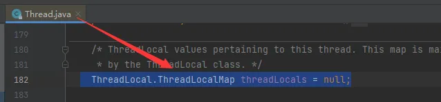
2. ThreadLocal 和 ThreadLocalmap
   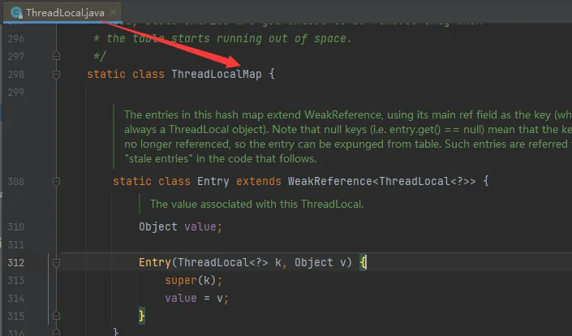

#### 三者关系总结
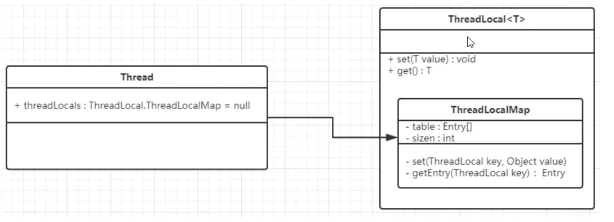
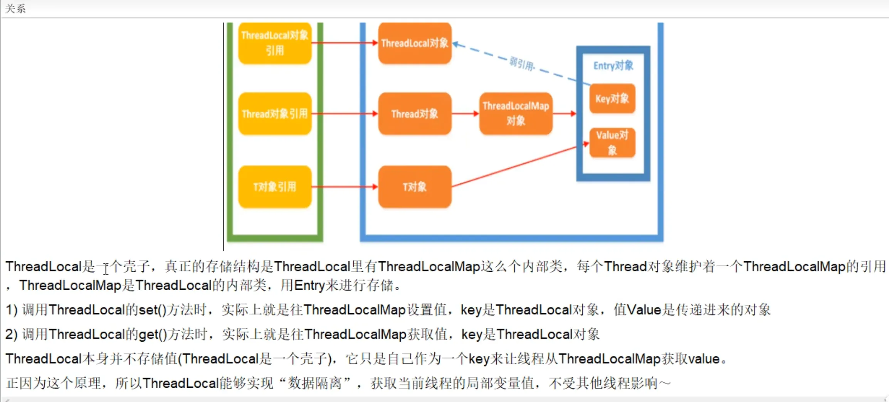
* `ThreadLocalMap` 实际上就是一个以 ThreadLocal 实例为key，任意对象为 value 的 Entry 对象。
* 当我们为ThreadLocal变量赋值，实际上就是以当前ThreadLocal实例为Key，值为value的Entry往这个ThreadLocalMap中存放

### 2.3 总结
ThreadLocalMap从字面上就可以看出这是一个保存ThreadLocal对象的map（其实是以ThreadLocal为Key），不过是经过了两层包装的ThreadLocal对象：
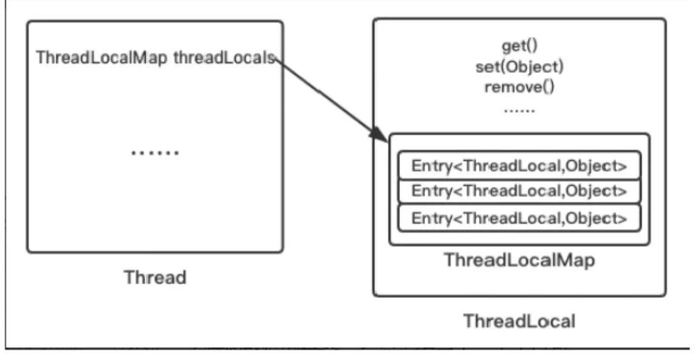
* JVM内部维护了一个线程版的`Map<ThreadLocal, Value>`（通过ThreadLocal对象的set方法，结果把`ThreadLocal`对象自己当作Key，放进了`ThreadLocalMap`中），每个线程要用到这个T的时候，用当前的线程去Map里面获取，通过这样让每个线程都拥有了自己独立的变量，人手一份，竞争条件被彻底消除，在并发模式下是绝对安全的变量。

## 3. ThreadLocal 内存泄漏问题
### 3.1 什么是内存泄漏
不再被使用的对象or变量占用的内存不能被回收，就是内存泄漏。

### 3.2 谁惹的祸？
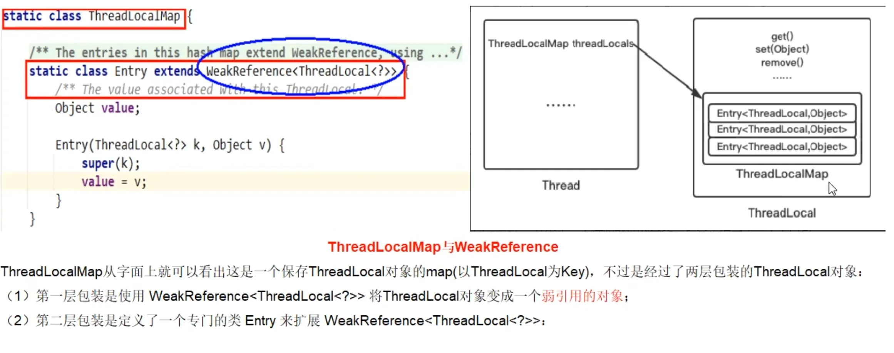

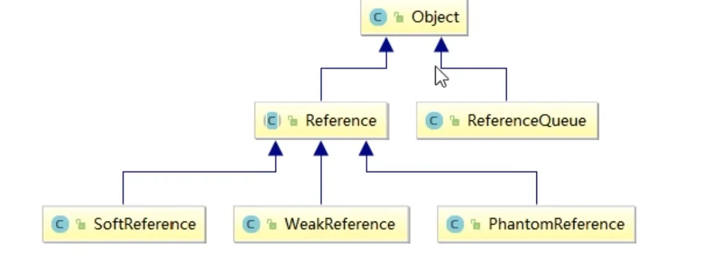

* **强引用**：
  * 对于强引用的对象，就算是出现了OOM也不会对该对象进行回收，死都不收，当一个对象被强引用变量引用时，它处于可达状态，是不可能被垃圾回收机制回收的，即使该对象以后永远都不会被用到，JVM也不会回收，因此强引用是造成Java内存泄露的主要原因之一。
* **软引用**： 
  * 是一种相对强引用弱化了一些的引用，对于只有软引用的对象而言，当系统内存充足时，不会被回收，当系统内存不足时，他会被回收，软引用通常用在对内存敏感的程序中，比如高速缓存，内存够用就保留，不够用就回收。
* **弱引用**：
  * 比软引用的生命周期更短，对于只有弱引用的对象而言，只要垃圾回收机制一运行，不管JVM的内存空间是否足够，都会回收该对象占用的内存。
* 软引用和弱引用的使用场景----->假如有一个应用需要读取大量的本地图片：
  * 如果每次读取图片都从硬盘读取则会严重影响性能
  * 如果一次性全部加载到内存中又可能会造成内存溢出
  * 此时使用软应用来解决，设计思路时：用一个HashMap来保存图片的路径和与相应图片对象关联的软引用之间的映射关系，在内存不足时，JVM会自动回收这些缓存图片对象所占用的空间，有效避免了OOM的问题
* **虚引用**：
  * 虚引用必须和引用队列联合使用，如果一个对象仅持有虚引用，那么它就和没有任何引用一样，在任何时候都有可能被垃圾回收器回收，它不能单独使用也不能通过它访问对象。
  * 虚引用的主要作用是跟踪对象被垃圾回收的状态。仅仅是提供了一种确保对象被finalize后，做某些事情的通知机制。换句话说就是在对象被GC的时候会收到一个系统通知或者后续添加进一步的处理，用来实现比finalize机制更灵活的回收操作。

### 3.3 为什么要用弱引用？不用如何？
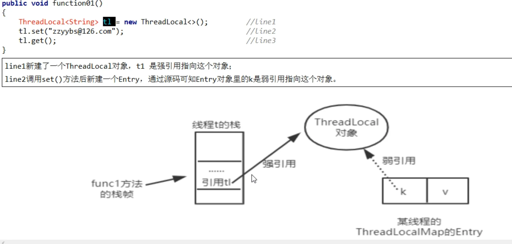

#### 为什么要用弱引用?
* 当方法执行完毕后，栈帧销毁，强引用t1也就没有了，但此时线程的ThreadLocalMap里某个entry的Key引用还指向这个对象，若这个Key是强引用，就会导致Key指向的ThreadLocal对象即V指向的对象不能被gc回收，造成内存泄露 
* 若这个引用时弱引用就大概率会减少内存泄漏的问题（当然，还得考虑key为null这个坑），使用弱引用就可以使ThreadLocal对象在方法执行完毕后顺利被回收且entry的key引用指向为null

#### 这里有个需要注意的问题
* ThreadLocalMap使用ThreadLocal的弱引用作为Key，如果一个ThreadLocal没有外部强引用引用他，那么系统gc时，这个ThreadLocal势必会被回收，这样一来，ThreadLocalMap中就会出现Key为null的Entry，就没有办法访问这些Key为null的Entry的value，如果当前线程迟迟不结束的话（好比正在使用线程池），这些key为null的Entry的value就会一直存在一条强引用链。
* 虽然弱引用，保证了Key指向的ThreadLocal对象能够被及时回收，但是v指向的value对象是需要ThreadLocalMap调用get、set时发现key为null时才会去回收整个entry、value，因此弱引用不能100%保证内存不泄露，我们要在不使用某个ThreadLocal对象后，手动调用remove方法来删除它，尤其是在线程池中，不仅仅是内存泄漏的问题，因为线程池中的线程是重复使用的，意味着这个线程的ThreadLocalMap对象也是重复使用的，如果我们不手动调用remove方法，那么后面的线程就有可能获取到上个线程遗留下来的value值，造成bug。
* 清除脏Entry----key为null的entry
  * set()
    * 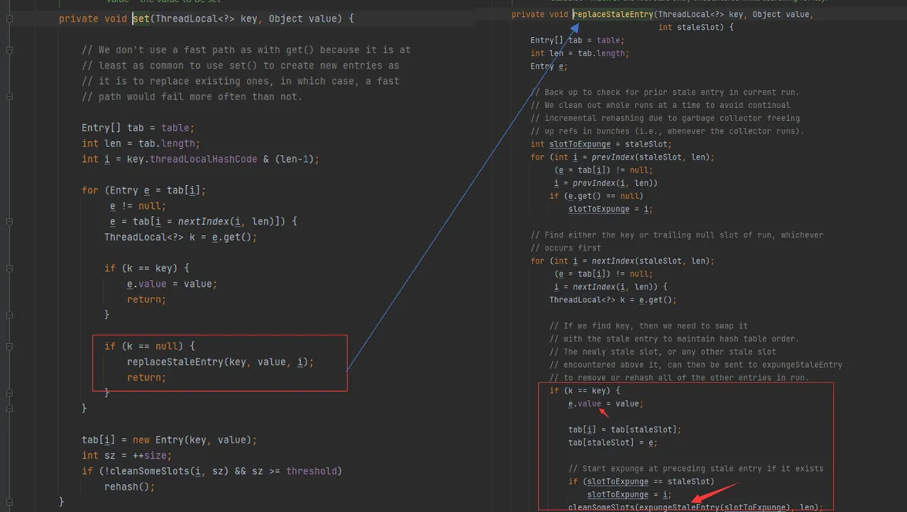
  * get()
    * 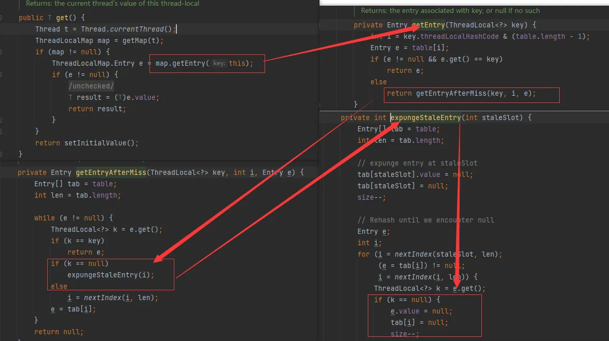
  * remove()
    * 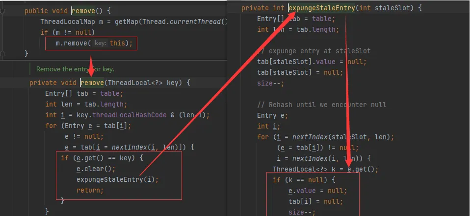

### 3.4 最佳实践
* ThreadLocal一定要初始化，避免空指针异常。
* 建议把ThreadLocal修饰为static
* 用完记得手动remove

## 4. 小总结
* `ThreadLocal` 并不解决线程间共享数据的问题
* `ThreadLocal` 适用于变量在线程间隔离且在方法间共享的场景
* `ThreadLocal` 通过隐式的在不同线程内创建独立实例副本避免了实例线程安全的问题
* 每个线程持有一个只属于它自己的专属map并维护了 `ThreadLocal` 对象与具体实例的映射，该Map由于只被持有他的线程访问，故不存在线程安全以及锁的问题
* `ThreadLocalMap` 的Entry对 `ThreadLocal` 的引用为弱引用。避免了 `ThreadLocal` 对象无法被回收的问题
* 都会通过 `expungeStaleEntry()`, `cleanSomeSlots()`, `replaceStaleEntry()` 这三个方法回收键为null的Entry对象的值（即为具体实例）以及entry对象本身从而防止内存泄漏，属于安全加固的方法
* 群雄逐鹿起纷争，人各一份天下安

## 使用场景
### 场景一: 线程间隔离, 使每个线程拥有一个独享的对象, 保证线程安全
> 我们知道很多JDK中提供的类都是线程不安全的, 比如说Random类, 我们可以用它来产生随机数, 为什么他是线程不安全的呢? 因为他其实是使用种子来产生随机数的, 使用旧种子产生新种子, 那么在多线程的情况下, 因为程序的异步性, 就可能有多个线程拿到相同的旧种子, 从而产生相同的新种子, 如果是这样, 这就不能叫做随机数了.
> 所以我们就需要每个线程都有一个独享的Random实例.

* [Demo04RandomTest.java](../AdvancedJUC/src/main/java/com/ylqi007/chap09threadlocal/Demo04RandomTest.java)

### 场景二: 线程内共享, 线程级别跨函数传递参数
> 在我们使用SpringMVC框架的时候, 我们可以在控制层通过HttpServlet获取Session, 但是如果我需要在服务层或者数据访问层获取Session怎么办? 或者如果我需要传递一些参数从控制层到其他层应该怎么做呢?
> 我们可以利用ThreadLocal线程内共享的特点, 把需要传递的参数使用ThreadLocal保存下来, 然后在需要使用的时候拿出来.

## Reference
* https://docs.oracle.com/en/java/javase/17/docs/api/java.base/java/lang/ThreadLocal.html
* [JUC并发编程：9. 聊聊ThreadLocal](https://www.yuque.com/gongxi-wssld/csm31d/tlmmbrtznb47967r#JPOGx)
* [八股取士: 分享｜[八股取士]Java多线程--ThreadLocal初步](https://leetcode.cn/discuss/post/3162333/ba-gu-qu-shi-javaduo-xian-cheng-threadlo-77xf/)
* [八股取士: 分享｜[八股取士]Java多线程--ThreadLocal原理](https://leetcode.cn/discuss/post/3162362/ba-gu-qu-shi-javaduo-xian-cheng-threadlo-xh1u/)
* [八股取士: 分享｜[八股取士]Java多线程--ThreadLocal深入理解](https://leetcode.cn/discuss/post/3162746/threadlocalshen-ru-li-jie-by-baguqushi-0ok9/)
* [八股取士: 分享｜[八股取士]Java多线程--InheritableThreadLocal线程共享](https://leetcode.cn/discuss/post/3162759/ba-gu-qu-shi-javaduo-xian-cheng-inherita-nwjg/)
* [八股取士: 分享｜[八股取士]Java多线程--ThreadLocal面试题汇总](https://leetcode.cn/discuss/post/3162760/ba-gu-qu-shi-javaduo-xian-cheng-threadlo-xcss/)