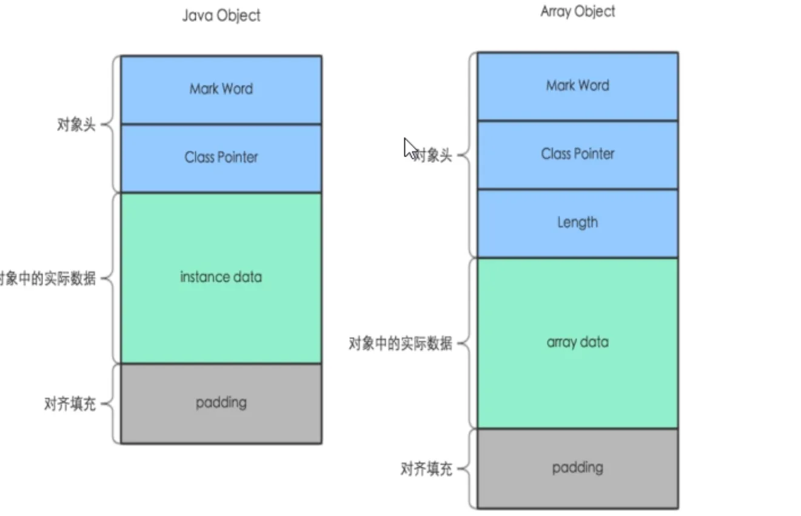
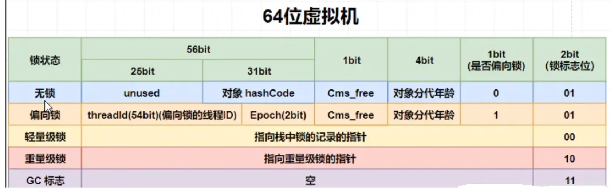

# Chap 10. Java对象内存布局

## 1. 面试题
* 说下JUC，AQS的大致流程
* CAS自旋锁，是获取不到锁就一直自旋吗？CAS和`synchronized`区别在哪里，为什么CAS好，具体优势在哪里？
* `synchronized`底层是如何实现的，实现同步的时候用到了CAS 了吗？具体哪里用到了？
* 对象头存储那些信息？长度是多少位存储？


## 2. `Object obj = new Object()` 谈谈你对这句话的理解？
* 位置所在 --------> JVM堆 --> 新生区 --> 伊甸园区
* 构成布局 --------> 对象头 + 实例数据 + 对齐填充


## 3. 对象在堆内存中的布局
### 3.1 权威定义 -- 《深入理解Java虚拟机》周志明
在 HotSpot 虚拟机里，对象在堆内存的存储布局可以划分为三个部分：对象头(Header)、实例数据(Instance Data)和对齐填充(Padding)。




### 3.2 对象在堆内存中的存储布局
#### 1. 对象头, Object Header
1. 对象标记(mark word)
   * 默认存储对象的 HashCode、分代年龄和锁标志等信息。
   * 这些信息都是与对象自身定义无关的数据，所以Mark Word被设计成一个非固定的数据结构以便在极小的空间内存存储尽量多的数据。
   * 它会根据对象的状态复用自己的存储空间，也就是说在运行期间MarkWord里存储的数据会随着锁标志位的变化而变化。
2. 类元信息(类型指针, klass pointer)
   * 对象指向它的类元数据的指针，虚拟机通过这个指针来确定这个对象哪个类的实例。

在64位系统中，`mark word` 占了8个字节，`klass pointer`(类型指针)占了8个字节，一共是16个字节
> `object header`
Common structure at the beginning of every GC-managed heap object. (Every oop points to an object header.) Includes fundamental information about the heap object's layout, type, GC state, synchronization state, and identity hash code. Consists of two words. In arrays it is immediately followed by a length field. Note that both Java objects and VM-internal objects have a common object header format.
>
> `mark word`
The first word of every object header. Usually a set of bitfields including synchronization state and identity hash code. May also be a pointer (with characteristic low bit encoding) to synchronization related information. During GC, may contain GC state bits.
>
> `klass pointer`
The second word of every object header. Points to another object (a metaobject) which describes the layout and behavior of the original object. For Java objects, the "klass" contains a C++ style "vtable".


#### 2. 实例数据, Data Instance
存放类的属性（Field）数据信息，包括父类的属性信息

#### 3. 对齐填充, Padding (保证8个字节的倍数)
虚拟机要求对象起始地址必须是8字节的整数倍，填充数据不是必须存在的，仅仅是为了字节对齐，这部分内存按8字节补充对齐。


## 4. 再说对象头的 MarkWord



## 5. 聊聊 `Object obj = new Object()`
### 5.1 运行结果展示
```shell
java.lang.Object object internals:
OFF  SZ   TYPE DESCRIPTION               VALUE
  0   8        (object header: mark)     0x0000000000000001 (non-biasable; age: 0)
  8   4        (object header: class)    0x00000d68
 12   4        (object alignment gap)    
Instance size: 16 bytes
Space losses: 0 bytes internal + 4 bytes external = 4 bytes total
```


### 5.2 压缩指针
#### 1. 默认测试结果
```shell
% java -XX:+PrintCommandLineFlags -version
-XX:ConcGCThreads=3 -XX:G1ConcRefinementThreads=10 -XX:GCDrainStackTargetSize=64 -XX:InitialHeapSize=805306368 -XX:MarkStackSize=4194304 -XX:MaxHeapSize=12884901888 -XX:MinHeapSize=6815736 -XX:+PrintCommandLineFlags -XX:ReservedCodeCacheSize=251658240 -XX:+SegmentedCodeCache -XX:+UseCompressedClassPointers -XX:+UseCompressedOops -XX:+UseG1GC 
openjdk version "17.0.13" 2024-10-15 LTS
OpenJDK Runtime Environment Corretto-17.0.13.11.1 (build 17.0.13+11-LTS)
OpenJDK 64-Bit Server VM Corretto-17.0.13.11.1 (build 17.0.13+11-LTS, mixed mode, sharing)
```
* `-XX:+UseCompressedClassPointers` 说明默认开启压缩指针，开启后将上述类型指针压缩为4字节，以节约空间。

比如，`Object obj = new Object()`，通过JOL打印出内存布局
```shell
java.lang.Object object internals:
OFF  SZ   TYPE DESCRIPTION               VALUE
  0   8        (object header: mark)     0x0000000000000001 (non-biasable; age: 0)
  8   4        (object header: class)    0x00000d68
 12   4        (object alignment gap)    
Instance size: 16 bytes
Space losses: 0 bytes internal + 4 bytes external = 4 bytes total
```
* 其中`(object header: class)    0x00000d68`，就显示出`klass pointer`是4个字节。


#### 2. 手动关闭压缩指针
Add VM Options: `-XX:-UseCompressedClassPointers`
```shell
# VM Options: -XX:-UseCompressedClassPointers

# WARNING: Unable to get Instrumentation. Dynamic Attach failed. You may add this JAR as -javaagent manually, or supply -Djdk.attach.allowAttachSelf
# WARNING: Unable to attach Serviceability Agent. You can try again with escalated privileges. Two options: a) use -Djol.tryWithSudo=true to try with sudo; b) echo 0 | sudo tee /proc/sys/kernel/yama/ptrace_scope
java.lang.Object object internals:
OFF  SZ   TYPE DESCRIPTION               VALUE
  0   8        (object header: mark)     0x0000000000000001 (non-biasable; age: 0)
  8   8        (object header: class)    0x0000000121001d30
Instance size: 16 bytes
Space losses: 0 bytes internal + 0 bytes external = 0 bytes total

com.ylqi007.chap10javaobjectmemorylayout.JOLCustomer object internals:
OFF  SZ      TYPE DESCRIPTION               VALUE
  0   8           (object header: mark)     0x0000000000000001 (non-biasable; age: 0)
  8   8           (object header: class)    0x0000000121e2e658
 16   4       int JOLCustomer.id            0
 20   1   boolean JOLCustomer.flag          false
 21   3           (object alignment gap)    
Instance size: 24 bytes
Space losses: 0 bytes internal + 3 bytes external = 3 bytes total
```


## Reference
* [JUC并发编程：10. Java对象内存布局和对象头](https://www.yuque.com/gongxi-wssld/csm31d/bbcxglgcot07hgdo)
* https://openjdk.org/groups/hotspot/docs/HotSpotGlossary.html
* JOL: Java Object Layout
  * https://openjdk.org/projects/code-tools/jol/
  * https://github.com/openjdk/jol