# Chap 11. synchronized与锁升级

## 1. 面试题
* 谈谈你对 `synchronized` 的理解
*  `syn主要作用：
● 当一段同步代码一直被同一个线程多次访问，由于只有一个线程那么该线程在后续访问时便会自动获得锁
● 同一个老顾客来访，直接老规矩行方便
结论：
● HotSpot的作者经过研究发现，大多数情况下：在多线程情况下，锁不仅不存在多线程竞争，还存在由同一个线程多次获得的情况，偏向锁就是在这种情况下出现的，它的出现是为了解决只有一个线程执行同步时提高性能。
● 偏向锁会偏向于第一个访问锁的线程，如果在接下来的运行过程中，该锁没有被其他线程访问，则持有偏向锁的线程将永远不需要出发同步。也即偏向锁在资源在没有竞争情况下消除了同步语句，懒得连CAS操作都不做了，直接提高程序性能。chronized` 的锁升级你聊聊
*  `synchronized` 实现原理，monitor对象什么时候生成的？知道monitor的`monitorenter`和`monitorexit`这两个是怎么保证同步的嘛？或者说这两个操作计算机底层是如何执行的
* 偏向锁和轻量级锁有什么区别


## 2. synchronized 的性能变化
* Java5以前，只有 `synchronized`，这个是操作系统级别的重量级操作
  * 重量级锁，假如锁的竞争比较激烈的话，性能下降
  * Java 5之前**用户态**和**内核态**之间的转换
  * 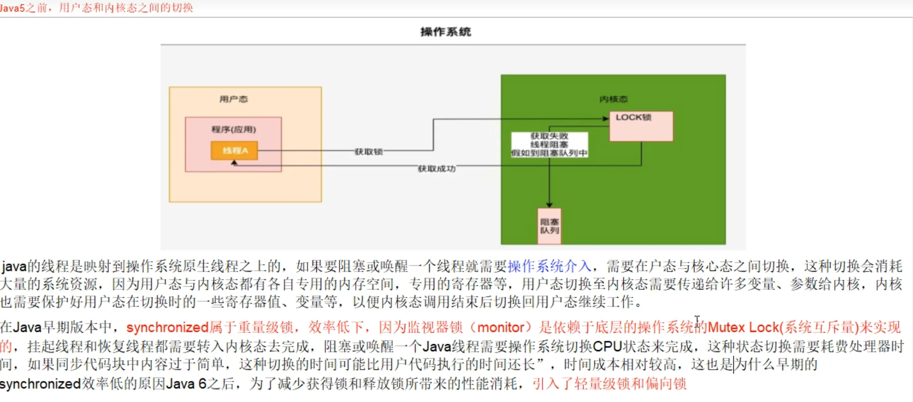
  * Java6 之后为了减少获得锁和释放锁所带来的性能消耗，引入了**轻量级锁**和**偏向锁**


## 3. synchronized 锁的种类及升级步骤
### 3.1 多线程访问情况
* 只有一个线程来访问，有且唯一Only One
* 有两个线程（2个线程交替访问）
* 竞争激烈，更多线程来访问


### 3.2 升级流程
`synchronized` 用的锁是存在Java对象头里的`MarkWord`中，锁升级功能主要依赖`MarkWord`中**锁标志位**和释放**偏向锁标志位**

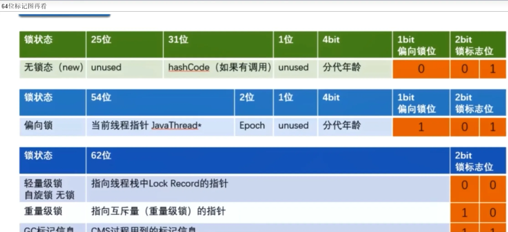
锁指向，请牢记
* 偏向锁：MarkWord存储的是偏向的线程ID
* 轻量锁：MarkWord存储的是指向线程栈中Lock Record的指针
* 重量锁：MarkWord存储的是指向堆中的monitor对象（系统互斥量指针）


### 3.3 无锁
初始状态，一个对象被实例化后，如果还没有被任何线程竞争锁，那么它就是无锁状态(MarkWord 的最后3 bits 为`001`)

代码示例：[Demo01NoLock.java](../AdvancedJUC/src/main/java/com/ylqi007/chap11synchronizedup/Demo01NoLock.java)


### 3.4 偏锁
**偏向锁**：**单线程竞争**，当线程A第一次竞争到锁时，通过修改MarkWord中的偏向线程ID、偏向模式。如果不存在其他线程竞争，那么持有偏向锁的线程将永远不需要进行同步。

主要作用：
* **当一段同步代码一直被同一个线程多次访问，由于只有一个线程那么该线程在后续访问时便会自动获得锁**
* 同一个老顾客来访，直接老规矩行方便

结论：
* HotSpot的作者经过研究发现，大多数情况下：在多线程情况下，锁不仅不存在多线程竞争，还存在由同一个线程多次获得的情况，偏向锁就是在这种情况下出现的，它的出现是为了解决只有一个线程执行同步时提高性能。
* 偏向锁会偏向于第一个访问锁的线程，如果在接下来的运行过程中，该锁没有被其他线程访问，则持有偏向锁的线程将永远不需要出发同步。也即偏向锁在资源在没有竞争情况下消除了同步语句，懒得连CAS操作都不做了，直接提高程序性能。

理论：


技术实现：
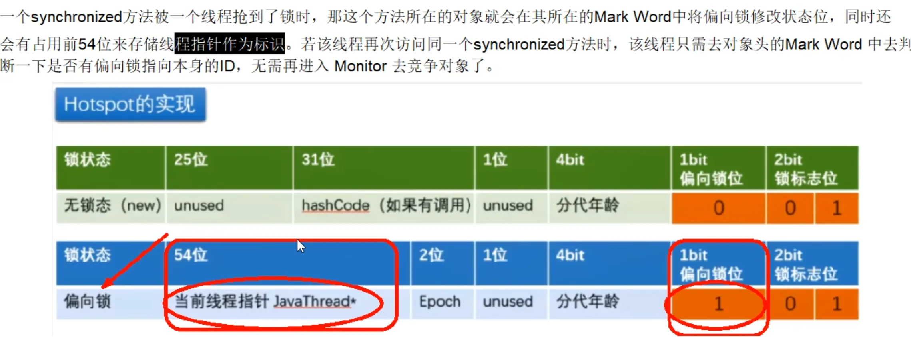

偏向锁JVM指令：
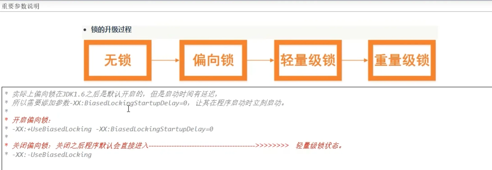


实例代码：
* [Demo03BiasedLock.java](../AdvancedJUC/src/main/java/com/ylqi007/chap11synchronizedup/Demo03BiasedLock.java)
* [Demo03BiasedLock2.java](../AdvancedJUC/src/main/java/com/ylqi007/chap11synchronizedup/Demo03BiasedLock2.java)
* [Demo03BiasedLock3.java](../AdvancedJUC/src/main/java/com/ylqi007/chap11synchronizedup/Demo03BiasedLock3.java)


#### 偏向锁撤销
* 当有另外一个线程逐步来竞争锁的时候，就不能再使用偏向锁了，要升级为轻量级锁，使用的是等到竞争出现才释放锁的机制
* 竞争线程尝试CAS更新对象头失败，会等到全局安全点（此时不会执行任何代码）撤销偏向锁，同时检查持有偏向锁的线程是否还在执行：
  * 第一个线程正在执行Synchronized方法（处于同步块），它还没有执行完，其他线程来抢夺，该偏向锁会被取消掉并出现锁升级，此时轻量级锁由原来持有偏向锁的线程持有，继续执行同步代码块，而正在竞争的线程会自动进入自旋等待获得该轻量级锁
  * 第一个线程执行完Synchronized（退出同步块），则将对象头设置为无所状态并撤销偏向锁，重新偏向。
  * 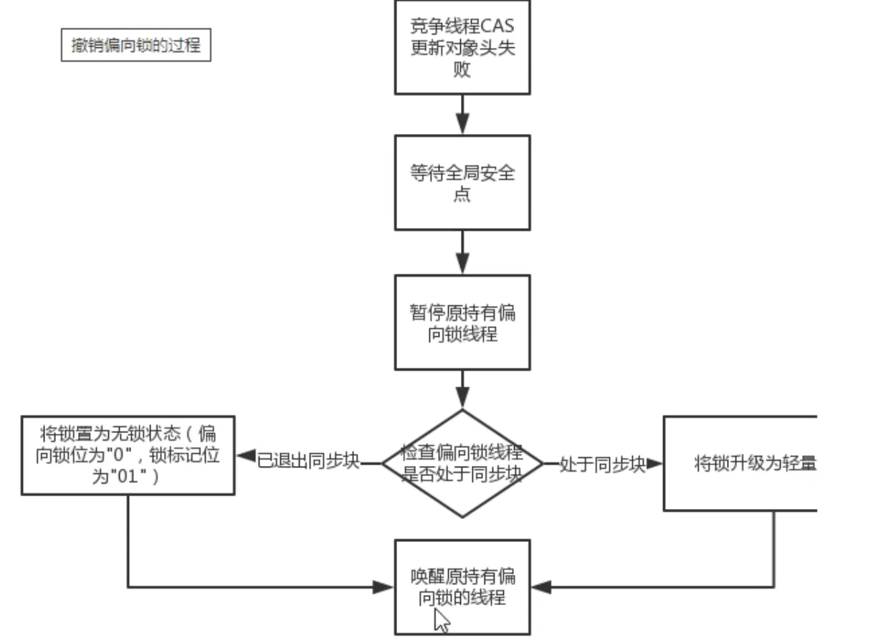

题外话：Java15以后逐步废弃偏向锁，需要手动开启------->维护成本高
* [JEP 374: Deprecate and Disable Biased Locking](https://openjdk.org/jeps/374)


### 3.5 轻锁
* **概念**：**多线程竞争，但是任意时候最多只有一个线程竞争**，即不存在锁竞争太激烈的情况，也就没有线程阻塞。
* **主要作用**：有线程来参与锁的竞争，但是获取锁的冲突时间极短---------->**本质是自旋锁CAS**
* 轻量锁的获取：
  * 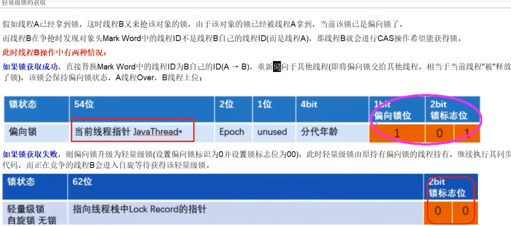
  * 
  * 
  * 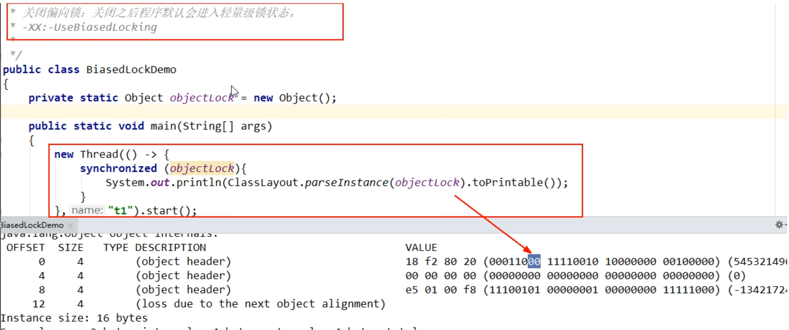


自旋一定程度和次数（**Java8 之后是自适应自旋锁**------意味着自旋的次数不是固定不变的）：
* 线程如果自旋成功了，那下次自旋的最大次数会增加，因为JVM认为既然上次成功了，那么这一次也大概率会成功
* 如果很少会自选成功，那么下次会减少自旋的次数甚至不自旋，避免CPU空转


轻量锁和偏向锁的区别：
* 争夺轻量锁失败时，自旋尝试抢占锁
* 轻量级锁每次退出同步块都需要释放锁，而偏向锁是在竞争发生时才释放锁


### 3.6 重锁
有大量线程参与锁的竞争，冲突性很高
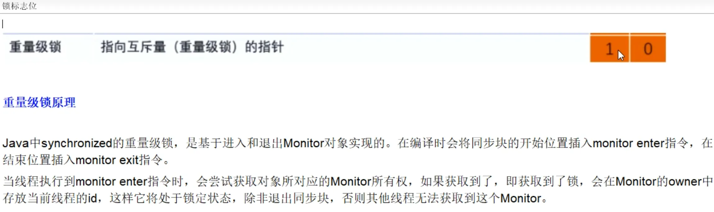


### 3.7 小总结
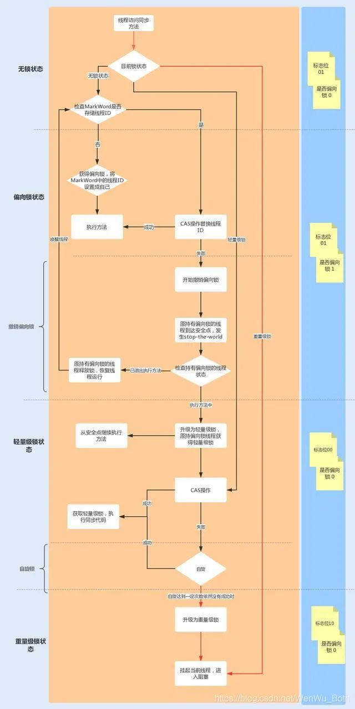


#### 1. 锁升级后，hashcode去哪儿了?
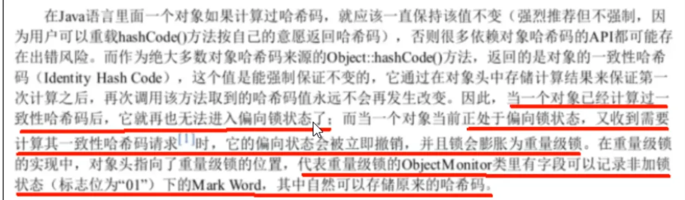
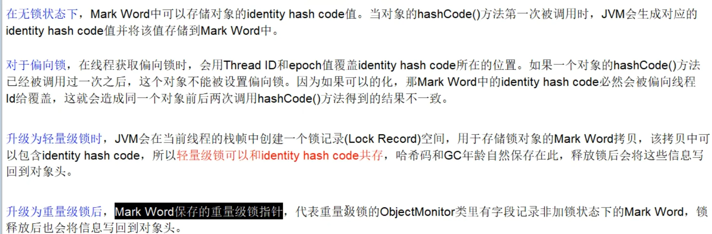


#### 2. 各种锁优缺点、synchronized锁升级和实现原理
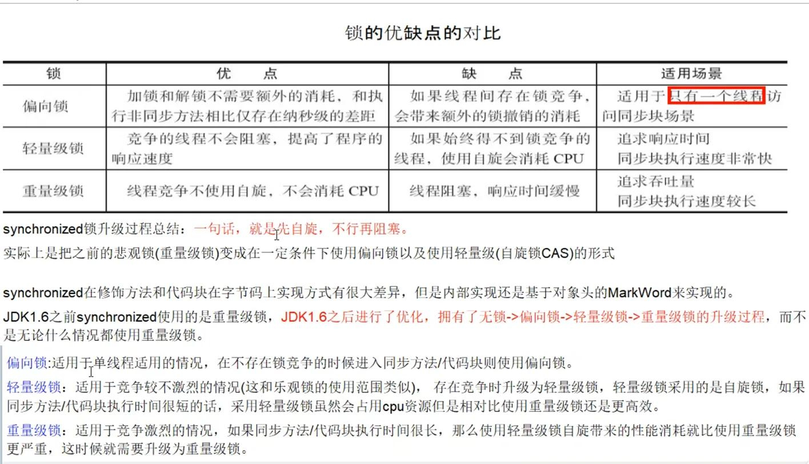


## 4. JIT编译器对锁的优化
### 4.1 JIT
Just In Time Compiler 即时编译器


### 4.2 消除锁
代码示例：[Demo06LockClearUp.java](../AdvancedJUC/src/main/java/com/ylqi007/chap11synchronizedup/Demo06LockClearUp.java)


### 4.3 粗化锁
代码示例：[Demo07LockBig.java](../AdvancedJUC/src/main/java/com/ylqi007/chap11synchronizedup/Demo07LockBig.java)


## 5. 小总结
1. 没有锁：自由自在
2. 偏向锁：唯我独尊
3. 轻量锁：楚汉争霸
4. 重量锁：群雄逐鹿


## Reference
* [JUC并发编程: 11. Synchronized与锁升级](https://www.yuque.com/gongxi-wssld/csm31d/cwpdcrqqy3r8mhyd)
* [JEP 374: Deprecate and Disable Biased Locking](https://openjdk.org/jeps/374) since JDK 15


---

```shell
% java -XX:+PrintFlagsInitial | grep BiasedLock
intx BiasedLockingBulkRebiasThreshold         = 20                                        {product} {default}
intx BiasedLockingBulkRevokeThreshold         = 40                                        {product} {default}
intx BiasedLockingDecayTime                   = 25000                                     {product} {default}
intx BiasedLockingStartupDelay                = 0                                         {product} {default}
bool UseBiasedLocking                         = false                                     {product} {default}
```


