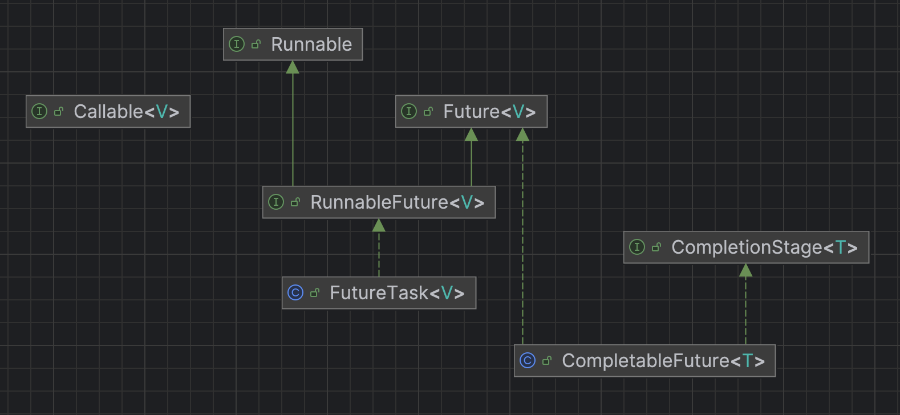

# Runnable, Callable, Future, FutureTask



## Runnable
```java
// Since 1.0
@FunctionalInterface
public interface Runnable {
    public abstract void run();
}
```


## Callable
```java
// Since 1.5
@FunctionalInterface
public interface Callable<V> {
    V call() throws Exception;
}
```


## Future
```java
// Since 1.5
public interface Future<V> {
    boolean cancel(boolean mayInterruptIfRunning);  // 取消任务
    boolean isCancelled();  // 判断任务是否已经取消
    boolean isDone();       // 判断任务是否已经结束

    // 获取任务执行结果
    V get() throws InterruptedException, ExecutionException;

    // 获取任务执行结果，支持超时
    V get(long timeout, TimeUnit unit) throws InterruptedException, ExecutionException, TimeoutException;  
}
```
* `Future` 也是一个接口，它可以对具体的 `Runnable` 或者 `Callable` 任务进行取消、判断任务是否已经取消、查询任务是否完成、获取任务结果。
* `Future` 的两个 `get(...)` 方法都能返回结果。这两个方法都会阻塞当前调用 `get()` 方法的线程，直到返回结果或着超时才会唤醒当前线程。


## RunnableFuture
```java
// Since 1.6
public interface RunnableFuture<V> extends Runnable, Future<V> {
    void run();
}
```
`Runnable.run()` vs `RunnableFuture.run()`
* 形式上: 方法签名完全一样(`void run()`)，因此 `RunnableFuture` 是对 `Runnable` 的增强，而不是改变。
* 总结: 
  * `Runnable.run()`: 仅执行逻辑。
  * `RunnableFuture.run()`: 执行逻辑 + 更新 `Future` 的结果、状态、异常，让任务成为“可运行 + 可获取结果”的一体化对象。


## FutureTask
```java
// Since 1.5
public class FutureTask<V> implements RunnableFuture<V> {
    /** The underlying callable; nulled out after running */
    private Callable<V> callable;
    /** The result to return or exception to throw from get() */
    private Object outcome; // non-volatile, protected by state reads/writes
    /** The thread running the callable; CASed during run() */
    private volatile Thread runner;
    /** Treiber stack of waiting threads */
    private volatile WaitNode waiters;
    
    // Constructors
    public FutureTask(Callable<V> callable) {
        if (callable == null)
            throw new NullPointerException();
        this.callable = callable;
        this.state = NEW;       // ensure visibility of callable
    }
    
    public FutureTask(Runnable runnable, V result) {
        this.callable = Executors.callable(runnable, result);
        this.state = NEW;       // ensure visibility of callable
    }
    
    // Methods
}
```
* 因为 `Future` 只是一个接口，无法直接用来创建对象，因此就有了 `FutureTask`。
* `FutureTask` 不是 interface，而是一个 class。它实现了 `RunnableFuture` 接口。
* 它可以作为 `Runnable` 被线程执行，又可以有 `Future` 的那些方法。


## Reference
* [一次搞懂 Runnable、Callable、Future、FutureTask，不懂不要钱！](https://blog.csdn.net/AlbenXie/article/details/108730675)