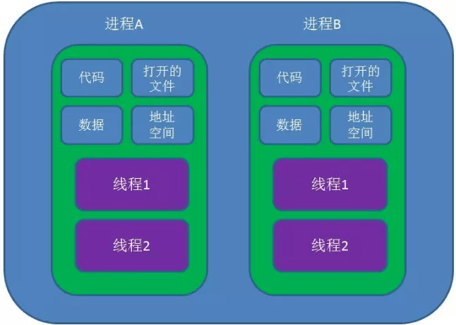

# 进程(Process)与线程(Thread)

* **进程(Process)**: 进程是程序的一次执行，是系统进行资源分配和调度的基本单位。每个进程都有独立的内存空间和系统资源，例如代码、数据、打开的文件等。
* **线程(Thread)**: 线程是进程中的一个执行单元，是CPU调度的最小单位。一个进程可以包含多个线程，这些线程共享进程的资源，但每个线程都有自己的程序计数器、栈等。
* **关系:** 进程是容器，线程是容器内的执行流。操作系统分配资源给进程，然后进程内的线程共享这些资源，并由CPU调度执行。
* **区别:** 进程是资源分配的基本单位，线程是CPU调度的基本单位。
  * 进程拥有独立的资源，线程共享进程资源。
  * 创建和销毁进程的开销比线程大。
* 多线程的好处:
  * 多线程可以提高程序的并发性和效率，让程序在同一时间处理多个任务。
* **总结**: 进程是资源的拥有者和分配者，线程是执行者和调度的对象。

这句话是**操作系统设计里“进程”的核心定义**，我们拆开理解：

## 1. 进程(Process)
### 1. 资源分配的基本单位
当你运行一个程序，操作系统会为它创建一个进程： 
* **分配独立的内存空间**（代码段、数据段、堆、栈） 
* **分配系统资源**：文件描述符（打开文件）、网络端口、I/O 设备、句柄、权限等
* ✅**这些资源都归属于进程**，进程之间互不干扰。

> **所以：** 如果没有“进程”，操作系统就无法知道该把这些资源分配给谁，也无法隔离不同程序。

### 2. 调度的基本单位
操作系统的**调度器**（Scheduler）会把 CPU 时间片分配给进程：
* 你可以同时开浏览器 + 播放音乐 + 下载文件，本质上是多个进程**轮流**使用 CPU
* **抢占/时间片调度**、**优先级调度**等，都是以“进程”为粒度

> **所以：** CPU 不会直接调度“程序代码”，而是调度**进程**（程序的一次运行实例），这是多任务并发的基础。

### 3. 为什么不是“线程”？
* **线程**是调度的更细粒度单位（在现代操作系统里 CPU 实际调度的是线程），
* 但**资源的分配（内存、文件等）仍然是按进程来管理**，线程共享进程资源。
* 可以理解为：
  * **进程**：装载资源的“容器”
  * **线程**：在这个容器里跑任务的“执行单元”

### **一句话理解**：
> **进程是操作系统看待程序的最小“运行个体”，**
> 系统给它分资源（内存、文件、设备），并让调度器决定它什么时候上 CPU 执行。

## 2. 进程 vs 线程 vs 资源(示意图)

* **进程**：像容器，装着程序运行所需的**独立资源**（内存、打开的文件、句柄等）。
* **线程**：在进程里跑的执行单元，**共享进程资源**，有自己的栈和寄存器。
* **CPU 调度**：现代操作系统上**实际调度线程**，但资源**归进程**。

### 1. 多进程 vs 多线程对比表

| 特性       | **进程**                  | **线程**             |
| -------- | ----------------------- | ------------------ |
| **资源**   | 独立内存和系统资源               | 共享进程资源（堆/文件）       |
| **调度**   | 进程级调度（重量级）              | 线程级调度（轻量级）         |
| **开销**   | 创建/切换成本高（页表/上下文）        | 创建/切换成本低           |
| **通信**   | 依赖 IPC（管道/Socket/共享内存）  | 直接读写共享内存（需同步）      |
| **稳定性**  | 互不影响（隔离好）               | 一个线程崩溃可能影响整个进程     |
| **典型场景** | 多进程服务（Nginx、Chrome Tab） | 并发任务处理（Web 服务器线程池） |

### **一句话总结：**
* **进程** = 系统**资源管理和分配**的容器（隔离好，成本高）。
* **线程** = **进程内的执行单元**（共享资源，切换快）。
* 现代 OS：**资源按进程分配，CPU 调度按线程执行。**

## Reference
* [对进程和线程的理解，他们有什么区别？](https://www.jianghaizhi.com/research/systemsecurity/1747.html)