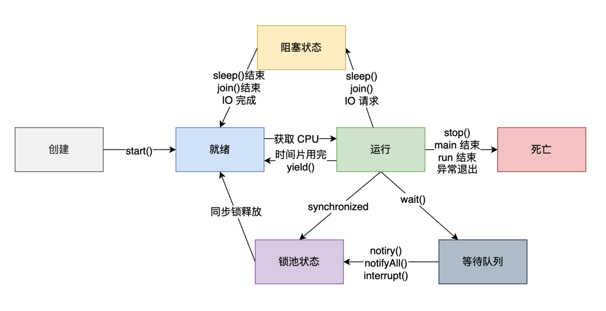

# 进程与线程的区别
一个进程可以有多个线程，就叫多线程。
* 进程，是对运行时程序的封装，是系统进行资源调度和分配的基本单位，实现了操作系统的并发。
* 线程，是进程的子任务，是CPU调度和分派的基本单位，实现了进程内部的并发。

## 1. 单一进程

## 2. 进程 ==> 批处理操作系统    
批处理操作系统。指令运行仍然是串行的，内存中始终只有一个程序在运行。受限于I/O操作、网络等原因阻塞，所以效率也不高。
    * 内存中能不能存在多个程序？==> 提出进程的概念。
    * **进程**就是**应用程序在内存中分配的空间，也就是正在运行的程序**，各个进程之间互不干扰。同时进程保存着程序每一个时刻运行的状态。
        * 进程 + CPU时间片轮转，从宏观上看起来同一时间段内执行多个任务。但事实上，对于单个CPU来说，任意时刻都只有一个任务在占用CPU资源。

## 3. 线程 ==> 
如果一个进程(process)中有多个子任务，只能逐个执行这些子任务，很影响效率。

能否让这些子任务同时执行？==> 提出线程概念。让一个线程执行一个子任务，这样一个进程就包含了多个线程，每个线程负责一个单独的子任务。

总之，**进程**和**线程**的提出极大的提高了操作系统的性能。进程让操作系统的并发性成为了可能，而线程让进程的内部并发成为了可能。

## 创建线程的方式
1. 继承 Thread 类
2. 实现 Runnable 接口
3. 实现 Callable 接口

## 控制线程的其他方法
针对线程，还有几个常用的方法
1. `sleep()` 使当前正在执行的线程暂停指定的毫秒数，也就是进入休眠的状态。需要注意的是，sleep 的时候要对异常进行处理。
2. `join()` 等待这个线程执行完才会轮到后续线程得到 CPU 的执行权，使用这个也要捕获异常。
3. `setDaemon()` 将此线程标记为守护线程，准确来说，就是服务其他的线程，像 Java 中的垃圾回收线程，就是典型的守护线程。
4. `yield()` `yield()`方法是一个静态方法，用于暗示当前线程愿意放弃其当前的时间片，允许其他线程执行。然而，它只是向线程调度器提出建议，调度器可能会忽略这个建议。具体行为取决于操作系统和 JVM 的线程调度策略。

## 线程的生命周期

## Reference
* [小米面试官：进程与线程的区别是什么？](https://javabetter.cn/thread/why-need-thread.html)
* [室友打了一把王者就学会了 Java 多线程](https://javabetter.cn/thread/wangzhe-thread.html)